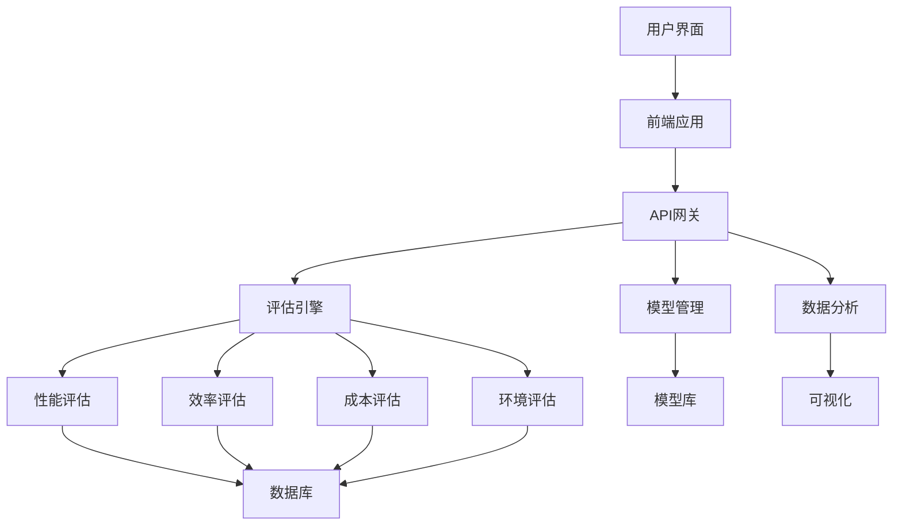

# GenAI模型能效评级体系构建：基于多维效质比的评估与市场价值分析

[](https://opensource.org/licenses/MIT)
[](https://www.python.org/)
[](https://reactjs.org/)
[](https://supabase.io/)

## 🎯 项目概述

本项目旨在构建一个全面、客观的GenAI（生成式人工智能）模型能效评级体系，通过多维效质比评估方法，为学术界和工业界提供标准化的模型评估工具，促进AI技术的可持续发展。

### 核心问题

当前GenAI模型评估存在以下挑战：
- **评估维度单一**: 过度关注性能指标，忽视效率和环境影响
- **标准不统一**: 缺乏行业统一的评估标准和方法
- **实用性不足**: 评估结果与实际应用场景脱节
- **可持续性考虑缺失**: 忽视模型的能耗和环境成本

### 解决方案

我们提出了**多维效质比评估框架**，综合考虑：
- 📊 **性能维度**: 准确性、泛化能力、鲁棒性
- ⚡ **效率维度**: 计算复杂度、推理速度、资源利用率
- 💰 **成本维度**: 训练成本、部署成本、运维成本
- 🌍 **环境维度**: 能耗、碳排放、可持续性

## 🚀 快速开始

### 环境要求

```bash
# Python环境
Python 3.8+
Node.js 16+
PostgreSQL 12+

# 推荐系统配置
CPU: 8核心+
内存: 16GB+
存储: 100GB+
GPU: NVIDIA GPU (可选，用于模型训练)
```

### 安装步骤

1. **克隆项目**
```bash
git clone https://github.com/your-org/genai-power-evaluation.git
cd genai-power-evaluation
```

2. **安装后端依赖**
```bash
cd backend
pip install -r requirements.txt
```

3. **安装前端依赖**
```bash
cd frontend
npm install
```

4. **配置环境变量**
```bash
cp .env.example .env
# 编辑.env文件，配置数据库连接等信息
```

5. **初始化数据库**
```bash
python scripts/init_database.py
```

6. **启动服务**
```bash
# 启动后端服务
python app.py

# 启动前端服务（新终端）
cd frontend
npm run dev
```

### 验证安装

访问 http://localhost:3000 查看前端界面，确认系统正常运行。

## 📚 文档导航

### 📖 学术文档
- **[研究背景与意义](docs/academic/01_background.md)** - 项目研究背景、问题定义和学术价值
- **[文献综述](docs/academic/02_literature_review.md)** - 相关研究现状和发展趋势
- **[方法论](docs/academic/03_methodology.md)** - 多维效质比评估理论框架
- **[实验设计](docs/academic/04_experiment_design.md)** - 实验方案和数据收集方法
- **[结果分析](docs/academic/05_results.md)** - 实验结果和统计分析
- **[讨论与展望](docs/academic/06_discussion.md)** - 研究发现和未来方向

### 🔧 技术文档
- **[技术架构](technical_architecture.md)** - 系统架构设计和技术选型
- **[产品需求](product_requirements.md)** - 功能需求和非功能性需求
- **[项目结构](project_structure.md)** - 目录结构和文件组织
- **[研究进度管理](research_progress_management.md)** - 时间规划和里程碑管理
- **[版本控制策略](version_control_strategy.md)** - Git工作流程和协作规范
- **[团队协作](collaboration_workflow.md)** - 团队组织和协作流程

### 💻 开发文档
- **[API文档](docs/api/README.md)** - RESTful API接口说明
- **[数据库设计](docs/database/README.md)** - 数据模型和表结构设计
- **[部署指南](docs/deployment/README.md)** - 系统部署和环境配置
- **[开发规范](docs/development/README.md)** - 编码规范和最佳实践

### 📊 使用指南
- **[用户手册](docs/user_manual/README.md)** - 系统功能使用说明
- **[管理员指南](docs/admin_guide/README.md)** - 系统管理和维护
- **[常见问题](docs/faq.md)** - 常见问题和解决方案

## 🏗️ 系统架构



### 核心模块

#### 🔍 评估引擎 (Evaluation Engine)
- **性能评估**: 模型准确性、泛化能力、鲁棒性评估
- **效率评估**: 计算复杂度、推理速度、资源利用率
- **成本评估**: 训练成本、部署成本、运维成本分析
- **环境评估**: 能耗估算、碳排放计算、可持续性评分

#### 📈 数据分析 (Data Analysis)
- **数据收集**: 多源数据采集和预处理
- **统计分析**: 描述性统计、假设检验、相关性分析
- **可视化**: 结果展示、趋势分析、对比图表
- **报告生成**: 自动化报告生成和导出

#### 🤖 模型管理 (Model Management)
- **模型注册**: 模型信息登记和元数据管理
- **版本控制**: 模型版本追踪和变更管理
- **性能监控**: 模型运行状态实时监控
- **生命周期**: 模型全生命周期管理

## 📋 功能特性

### 核心功能
- ✅ **多维度评估**: 支持性能、效率、成本、环境四个维度综合评估
- ✅ **自动化测试**: 集成化测试流程，减少人工干预
- ✅ **实时可视化**: 动态图表展示评估结果和趋势分析
- ✅ **报告生成**: 自动生成标准化评估报告
- ✅ **模型对比**: 支持多模型横向对比分析
- ✅ **历史追踪**: 完整的评估历史记录和版本管理

### 高级功能
- 🎯 **智能推荐**: 基于应用场景的模型推荐
- 📊 **预测分析**: 模型性能趋势预测和分析
- 🔗 **API集成**: 标准化API接口，支持第三方集成
- 📱 **移动端适配**: 响应式设计，支持移动设备访问
- 🔐 **权限管理**: 多级权限控制和用户管理
- 🌐 **多语言支持**: 中英文双语界面支持

## 🔬 实验设计

### 评估模型范围
- **大语言模型**: GPT系列、BERT系列、T5等
- **图像生成模型**: DALL-E、Stable Diffusion、Midjourney等
- **代码生成模型**: Codex、AlphaCode、CodeT5等
- **多模态模型**: CLIP、Flamingo、Gato等

### 评估数据集
- **学术基准**: GLUE、ImageNet、COCO等标准数据集
- **实际应用**: 真实业务场景数据集
- **合成数据**: 针对性构造的测试数据
- **对抗样本**: 鲁棒性测试专用数据

### 评估指标

#### 性能指标
- **准确性**: Top-1/Top-5准确率、F1分数、BLEU分数
- **泛化能力**: 跨域性能、少样本学习、零样本学习
- **鲁棒性**: 对抗攻击抵抗、噪声容忍度、分布外检测

#### 效率指标
- **计算复杂度**: FLOPs、参数数量、内存占用
- **推理速度**: 延迟、吞吐量、并发能力
- **资源利用**: CPU利用率、GPU利用率、能耗效率

#### 成本指标
- **训练成本**: 训练时间、硬件成本、电力成本
- **部署成本**: 服务器成本、存储成本、网络成本
- **运维成本**: 维护人力、监控成本、更新成本

#### 环境指标
- **能耗**: 训练能耗、推理能耗、待机能耗
- **碳排放**: 直接碳排放、间接碳排放
- **可持续性**: 可再生能源使用、碳中和程度

## 📈 项目进度

### 当前状态
- ✅ 项目启动和需求分析
- ✅ 技术架构设计
- ✅ 核心评估算法开发
- 🔄 系统集成和测试
- ⏳ 实验验证和优化
- ⏳ 论文撰写和整理

### 关键里程碑
- **2024年3月**: 架构设计完成
- **2024年6月**: 核心功能开发完成
- **2024年9月**: 系统测试和优化
- **2024年12月**: 论文提交和答辩

## 🤝 贡献指南

我们欢迎各种形式的贡献，包括：
- 🐛 **Bug报告**: 发现系统问题请及时报告
- 💡 **功能建议**: 提出新功能或改进建议
- 🔧 **代码贡献**: 提交代码修复或新功能
- 📖 **文档改进**: 完善文档和说明
- 🧪 **实验验证**: 参与实验设计和验证

详细贡献指南请查看 [CONTRIBUTING.md](CONTRIBUTING.md)

## 📄 许可证

本项目采用MIT许可证 - 查看 [LICENSE](LICENSE) 文件了解详细信息。

## 📞 联系方式

- **项目负责人**: 张教授 (zhang@university.edu)
- **技术负责人**: 李博士 (li@university.edu)
- **项目邮箱**: genai-power@university.edu
- **问题反馈**: [GitHub Issues](https://github.com/your-org/genai-power-evaluation/issues)

## 📮 致谢

感谢以下机构和个人对本项目的支持：
- 🏫 **某某大学** 人工智能学院
- 🔬 **某某实验室** 计算资源支持
- 💰 **某某基金** 项目资助
- 👥 **开源社区** 技术支持和贡献

## 📚 相关链接

- **[项目Wiki](https://github.com/your-org/genai-power-evaluation/wiki)** - 项目详细文档和知识库
- **[技术博客](https://blog.university.edu/genai-power)** - 项目进展和技术分享
- **[演示视频](https://youtube.com/watch?v=demo)** - 系统功能演示
- **[在线演示](https://demo.genai-power.com)** - 在线体验系统

---

<div align="center">

**⭐ 如果这个项目对你有帮助，请给我们一个Star！**

[⭐ Star本项目](https://github.com/your-org/genai-power-evaluation) • [🐛 报告问题](https://github.com/your-org/genai-power-evaluation/issues) • [💡 提交建议](https://github.com/your-org/genai-power-evaluation/discussions)

</div>