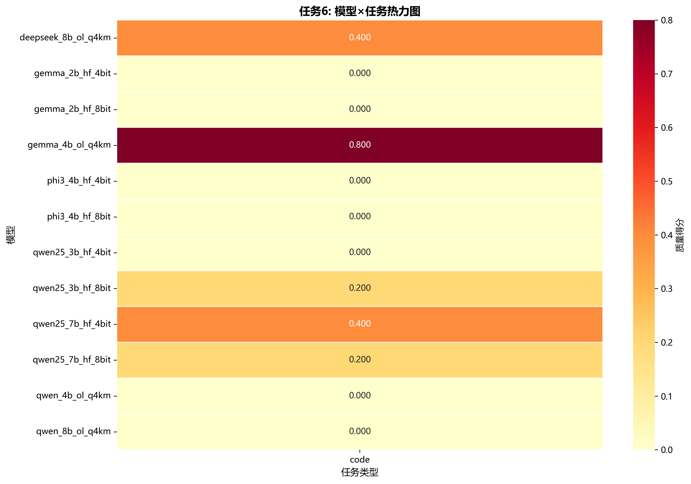
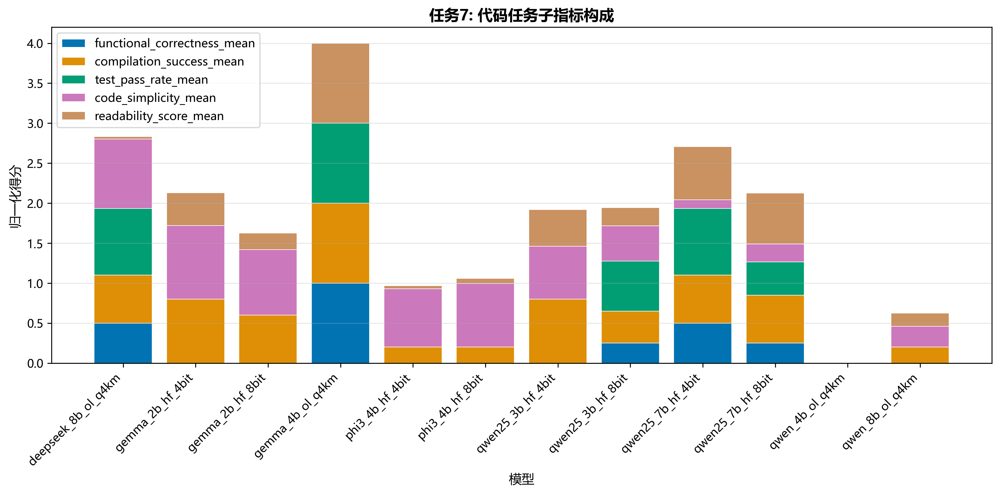
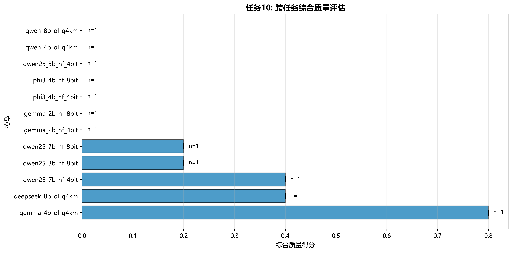

# 质量数据深度分析报告

**生成时间**: 2026-03-07 13:43:39

---

## 执行摘要

本报告对 1 个任务类型的质量评估数据进行了深度分析，涵盖数据探索、模型对比、任务专项分析、子指标关系、稳定性和跨任务综合评估。

## 关键洞察

### CODE 任务洞察

**质量得分统计**:
- 平均分: 0.167
- 中位数: 0.000
- 标准差: 0.253
- 得分范围: 0.000 - 0.800 (跨度: 0.800)
- 变异系数: 1.521 (模型间差异大，质量分化明显)

**最佳模型**: gemma_4b_ol_q4km, deepseek_8b_ol_q4km, qwen25_7b_hf_4bit

**待改进模型**: gemma_2b_hf_4bit, gemma_2b_hf_8bit, phi3_4b_hf_4bit

**稳定性分析**:
- 最稳定模型: gemma_2b_hf_4bit
- 最不稳定模型: deepseek_8b_ol_q4km
- 平均标准差: 0.203

**CODE任务特点**:
- 代码生成任务主要评估功能正确性、编译成功率和代码质量
- 建议关注: 语法正确性、逻辑完整性、代码可读性

## 分析维度

### 一、数据探索性分析

#### 任务1: 质量得分分布

#### 任务2: 按模型分组的箱线图

#### 任务3: 缺失值分析

详见: `../tables/missing_values.csv`

### 二、模型对比分析

#### 任务4: 模型排名条形图

#### 任务5: 雷达图

#### 任务6: 模型×任务热力图

### 三、任务专项分析

#### 任务7: 代码任务专项分析

### 四、子指标关系分析

#### 任务8: 相关性矩阵

### 五、质量稳定性分析

#### 任务9: 模型稳定性对比

### 六、跨任务综合评估

#### 任务10: 综合质量得分

## 数据质量

- 任务类型数: 1
- code: 12 个模型

## 从图表中得出的结论

### 任务1: 质量得分分布图

**从图表可以得出**:

**code任务**:
- 得分分布右偏，存在高分模型拉高平均值(均值0.167 > 中位数0.000)
- 模型质量分化明显，变异系数达1.521，说明模型能力差距大
- 整体质量有待提高，平均分仅0.167，需要重点优化

### 任务2-4: 模型对比图

**从图表可以得出**:

**code任务**:
- 最佳模型: gemma_4b_ol_q4km，建议在该任务上优先使用
- 次优模型: deepseek_8b_ol_q4km, qwen25_7b_hf_4bit，可作为备选方案
- 待改进模型: gemma_2b_hf_4bit，需要针对性优化
- 最稳定模型: gemma_2b_hf_4bit，输出质量波动小，适合生产环境
- 最不稳定模型: deepseek_8b_ol_q4km，输出质量波动大，需要多次采样

### 任务6: 模型×任务热力图

**从图表可以得出**:

- 通过热力图可以快速识别每个模型在不同任务上的强弱项
- 深色区域表示该模型在该任务上表现优秀，浅色区域表示需要改进
- 可以根据实际应用场景选择在特定任务上表现最佳的模型
- 横向对比可以看出模型的全面性，纵向对比可以看出任务的难度

### 任务8: 子指标相关性矩阵

**从图表可以得出**:

- 强正相关(>0.7)的指标说明它们衡量的是相似的质量维度
- 弱相关或负相关的指标说明它们衡量的是独立的质量维度
- 可以根据相关性选择代表性指标，避免冗余评估
- 负相关可能揭示质量权衡关系(如速度vs准确性)

### 任务9: 稳定性对比图

**从图表可以得出**:

- 标准差小的模型输出稳定，适合对一致性要求高的场景
- 标准差大的模型输出多样，可能需要多次采样或温度调节
- 稳定性与平均质量不一定正相关，需要综合考虑

### 任务10: 跨任务综合评估

**从图表可以得出**:

- 综合得分高的模型在多个任务上表现均衡，适合通用场景
- 综合得分低但在特定任务上突出的模型适合专用场景
- 任务数量(n值)反映了模型的评估覆盖度
- 误差线反映了模型在不同任务间的性能波动

---

**分析完成时间**: 2026-03-07 13:43:39
