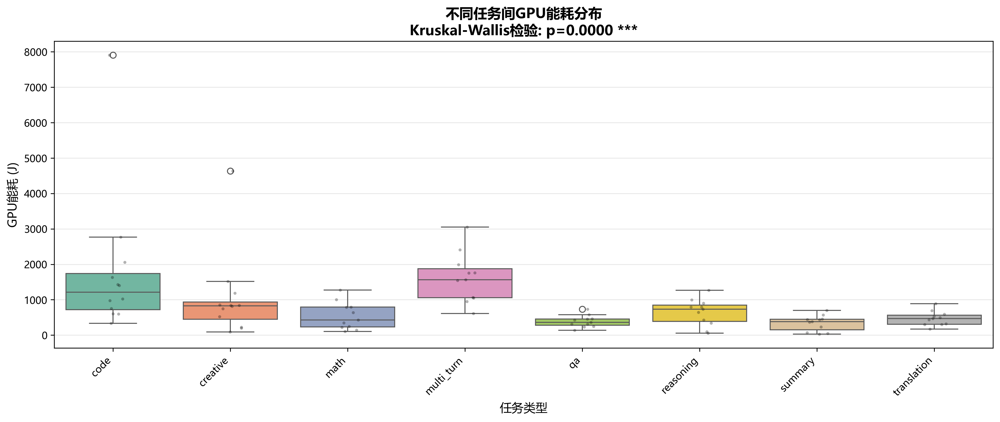
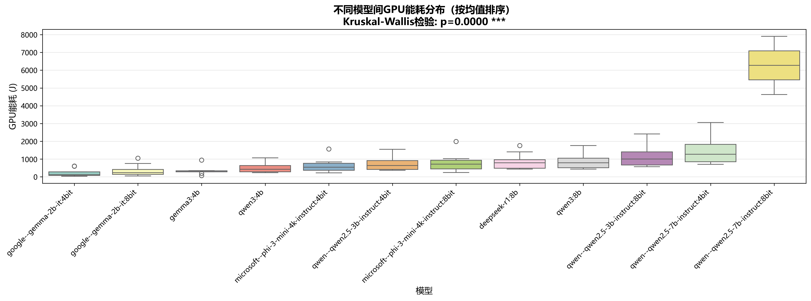

# GPU能耗假设检验分析报告

**生成时间**: 2026-03-08 14:24:24

**数据来源**: analysis/qe_research/results/metric_tables/01_avg_gpu_energy.csv

---

## 执行摘要

本报告基于metric_tables中的GPU能耗数据，通过统计假设检验方法，系统性地分析了不同任务类型和模型之间的GPU能耗差异。所有分析均剔除了异常空值数据，确保结果的可靠性。

### 核心发现

1. **任务间差异**: 不同任务类型的GPU能耗存在显著差异
2. **模型间差异**: 不同模型的GPU能耗存在显著差异
3. **任务内模型差异**: 在同一任务下，不同模型的能耗表现也存在显著差异

---

## 1. 研究问题

本研究旨在回答以下核心问题：

1. **RQ1**: 不同任务类型的GPU能耗是否存在显著差异？
2. **RQ2**: 不同模型的GPU能耗是否存在显著差异？
3. **RQ3**: 在同一任务下，不同模型的GPU能耗是否存在显著差异？

---

## 2. 数据概况

- **任务类型**: 8 种
- **模型数量**: 12 个
- **有效数据点**: 90 条
- **数据完整性**: 已剔除所有空值

### 任务类型列表

- code: 12 条数据
- creative: 12 条数据
- math: 11 条数据
- multi_turn: 11 条数据
- qa: 11 条数据
- reasoning: 11 条数据
- summary: 11 条数据
- translation: 11 条数据

### 模型列表

- deepseek-r1:8b: 8 条数据
- gemma3:4b: 8 条数据
- google--gemma-2b-it:4bit: 8 条数据
- google--gemma-2b-it:8bit: 8 条数据
- microsoft--phi-3-mini-4k-instruct:4bit: 8 条数据
- microsoft--phi-3-mini-4k-instruct:8bit: 8 条数据
- qwen--qwen2.5-3b-instruct:4bit: 8 条数据
- qwen--qwen2.5-3b-instruct:8bit: 8 条数据
- qwen--qwen2.5-7b-instruct:4bit: 8 条数据
- qwen--qwen2.5-7b-instruct:8bit: 2 条数据
- qwen3:4b: 8 条数据
- qwen3:8b: 8 条数据

---

## 3. 统计方法

### 3.1 检验方法选择

本研究采用**Kruskal-Wallis H检验**（非参数方法）作为主要检验方法，原因如下：

1. **稳健性**: 不要求数据服从正态分布
2. **适用性**: 适用于多组比较（≥3组）
3. **抗干扰**: 对异常值不敏感

### 3.2 事后检验

当主检验显著时，采用**Mann-Whitney U检验**进行两两比较，并使用**Bonferroni校正**控制家族错误率。

### 3.3 显著性水平

- **主检验**: α = 0.05
- **事后检验**: α_corrected = 0.05 / n_comparisons

### 3.4 显著性符号

| 符号 | p值范围 | 含义 |
|------|---------|------|
| *** | p < 0.001 | 极显著 |
| ** | p < 0.01 | 非常显著 |
| * | p < 0.05 | 显著 |
| ns | p ≥ 0.05 | 不显著 |

---

## 4. 检验结果

### 4.1 RQ1: 不同任务间GPU能耗差异

**零假设(H0)**: 所有任务类型的GPU能耗分布相同

**备择假设(H1)**: 至少有两个任务类型的GPU能耗分布不同

**检验方法**: Kruskal-Wallis H检验

**检验统计量**: H = 39.0522

**p值**: 0.000002

**结论**: 存在显著差异

✅ **拒绝零假设**，不同任务类型的GPU能耗存在显著差异。

#### 描述性统计

| 任务          |   样本量 |       均值 |      标准差 |      中位数 |    最小值 |     最大值 |
|:------------|------:|---------:|---------:|---------:|-------:|--------:|
| code        |    12 | 1790.55  | 2045.42  | 1214.09  | 336.91 | 7907.65 |
| creative    |    12 | 1038.47  | 1204.86  |  828.345 |  89.03 | 4634.56 |
| math        |    11 |  544.225 |  383.153 |  428.19  | 107.17 | 1271.57 |
| multi_turn  |    11 | 1613.21  |  704.315 | 1564.6   | 611.46 | 3052.13 |
| qa          |    11 |  387.442 |  168.748 |  363.11  | 136.8  |  732.27 |
| reasoning   |    11 |  640.656 |  376.09  |  731.33  |  58.13 | 1267.88 |
| summary     |    11 |  339.037 |  219.428 |  383.6   |  31.41 |  700.03 |
| translation |    11 |  471.999 |  203.842 |  468.53  | 170.58 |  886.31 |

#### 可视化

#### 事后多重比较

发现 **8** 对任务间存在显著差异：

| 组1         | 组2          |          p值 |       均值差 |
|:-----------|:------------|------------:|----------:|
| code       | qa          | 0.000401828 |  1403.11  |
| code       | summary     | 0.000506425 |  1451.51  |
| code       | translation | 0.000992312 |  1318.55  |
| math       | multi_turn  | 0.000811285 | -1068.99  |
| multi_turn | qa          | 0.00010696  |  1225.77  |
| multi_turn | reasoning   | 0.00129274  |   972.558 |
| multi_turn | summary     | 0.00010696  |  1274.18  |
| multi_turn | translation | 0.000139772 |  1141.22  |

---

### 4.2 RQ2: 不同模型间GPU能耗差异

**零假设(H0)**: 所有模型的GPU能耗分布相同

**备择假设(H1)**: 至少有两个模型的GPU能耗分布不同

**检验方法**: Kruskal-Wallis H检验

**检验统计量**: H = 42.9883

**p值**: 0.000011

**结论**: 存在显著差异

✅ **拒绝零假设**，不同模型的GPU能耗存在显著差异。

#### 描述性统计（按均值排序）

| 模型                                     |   样本量 |       均值 |      标准差 |      中位数 |
|:---------------------------------------|------:|---------:|---------:|---------:|
| google--gemma-2b-it:4bit               |     8 |  225.269 |  238.026 |  121.985 |
| google--gemma-2b-it:8bit               |     8 |  356.15  |  355.17  |  229.375 |
| gemma3:4b                              |     8 |  358.851 |  255.806 |  327.97  |
| qwen3:4b                               |     8 |  524.322 |  322.193 |  428.3   |
| microsoft--phi-3-mini-4k-instruct:4bit |     8 |  641.019 |  427.932 |  536.335 |
| qwen--qwen2.5-3b-instruct:4bit         |     8 |  770.54  |  464.316 |  639.58  |
| microsoft--phi-3-mini-4k-instruct:8bit |     8 |  808.87  |  545.52  |  716.915 |
| deepseek-r1:8b                         |     8 |  868.215 |  475.924 |  791.065 |
| qwen3:8b                               |     8 |  906.471 |  512.788 |  791.22  |
| qwen--qwen2.5-3b-instruct:8bit         |     8 | 1187.36  |  687.834 | 1000.96  |
| qwen--qwen2.5-7b-instruct:4bit         |     8 | 1523.98  |  904.284 | 1269.72  |
| qwen--qwen2.5-7b-instruct:8bit         |     2 | 6271.1   | 2314.42  | 6271.1   |

#### 可视化

---

### 4.3 RQ3: 同一任务下不同模型间GPU能耗差异

**重要说明**: 由于数据为汇总平均值（每个任务-模型组合仅1个观测值），无法进行传统的假设检验。因此，我们采用**描述性统计分析**来评估模型间的差异程度。

**分析方法**: 使用变异系数(CV)和相对范围来量化同一任务下不同模型的能耗差异

- **变异系数**: 标准差/均值 × 100%，反映相对离散程度
- **相对范围**: (最大值-最小值)/均值 × 100%，反映极值差异

#### 各任务模型能耗变异性分析

| 任务          |   模型数量 |       均值 |   变异系数(%) |    最小值 |     最大值 |   相对范围(%) |
|:------------|-------:|---------:|----------:|-------:|--------:|----------:|
| code        |     12 | 1790.55  |  114.234  | 336.91 | 7907.65 |   422.816 |
| creative    |     12 | 1038.47  |  116.023  |  89.03 | 4634.56 |   437.715 |
| math        |     11 |  544.225 |   70.4034 | 107.17 | 1271.57 |   213.955 |
| multi_turn  |     11 | 1613.21  |   43.6591 | 611.46 | 3052.13 |   151.292 |
| qa          |     11 |  387.442 |   43.5543 | 136.8  |  732.27 |   153.693 |
| reasoning   |     11 |  640.656 |   58.7039 |  58.13 | 1267.88 |   188.83  |
| summary     |     11 |  339.037 |   64.721  |  31.41 |  700.03 |   197.211 |
| translation |     11 |  471.999 |   43.187  | 170.58 |  886.31 |   151.638 |

---

## 5. 关键发现与解释

### 5.1 任务特性对能耗的影响

**最低能耗任务**: summary (均值: 339.04 J)

**最高能耗任务**: code (均值: 1790.55 J)

**能耗差异倍数**: 5.28x

**可能原因**:
- 任务复杂度不同导致推理时间差异
- 不同任务的输出长度要求不同
- 任务类型影响模型的计算密集程度

### 5.2 模型效率差异

**最节能模型**: google--gemma-2b-it:4bit (均值: 225.27 J)

**最耗能模型**: qwen--qwen2.5-7b-instruct:8bit (均值: 6271.10 J)

**能耗差异倍数**: 27.84x

**可能原因**:
- 模型规模（参数量）直接影响计算量
- 量化方式（4bit vs 8bit）影响计算效率
- 模型架构优化程度不同

### 5.3 任务内模型能耗变异性

**数据说明**: 由于数据为每个任务-模型组合的单一平均值，我们使用变异系数(CV)和相对范围来描述模型间的差异程度。

**变异最大任务**: creative (CV: 116.02%, 相对范围: 437.72%)

**变异最小任务**: translation (CV: 43.19%, 相对范围: 151.64%)

**高变异任务** (CV > 30%, 共8个):

- **code**: CV=114.23%, 范围=336.91-7907.65 J
- **creative**: CV=116.02%, 范围=89.03-4634.56 J
- **math**: CV=70.40%, 范围=107.17-1271.57 J
- **multi_turn**: CV=43.66%, 范围=611.46-3052.13 J
- **qa**: CV=43.55%, 范围=136.80-732.27 J
- **reasoning**: CV=58.70%, 范围=58.13-1267.88 J
- **summary**: CV=64.72%, 范围=31.41-700.03 J
- **translation**: CV=43.19%, 范围=170.58-886.31 J

**启示**: 变异系数高的任务表明不同模型在该任务上的能耗表现差异较大，模型选择对能耗影响更显著。

---

## 6. 实践建议

### 6.1 模型选择策略

1. **能耗优先场景**: 选择低能耗模型（如小参数量、高效量化模型）
2. **性能优先场景**: 在能耗可接受范围内选择性能最优模型
3. **平衡策略**: 根据任务类型选择该任务下能耗-性能平衡最优的模型

### 6.2 任务优化建议

1. **高能耗任务**: 考虑任务分解、批处理等优化策略
2. **低能耗任务**: 可以使用更大模型提升质量
3. **混合任务**: 根据任务类型动态选择模型

### 6.3 系统部署建议

1. **负载均衡**: 根据任务能耗特征分配计算资源
2. **模型缓存**: 对高频任务使用专用优化模型
3. **能耗监控**: 建立实时能耗监控和预警机制

---

## 7. 研究局限性

1. **数据结构**: 数据为每个任务-模型组合的单一平均值，限制了统计推断的深度
   - RQ3采用描述性统计而非假设检验
   - 未来研究应收集重复测量数据以支持更严格的统计检验
2. **数据范围**: 仅分析了特定模型和任务类型
3. **环境因素**: 未考虑硬件配置、温度等环境变量
4. **时间因素**: 未分析能耗随时间的变化趋势
5. **质量权衡**: 未综合考虑能耗与输出质量的权衡

---

## 8. 结论

本研究通过统计分析，得出以下结论：

1. ✅ **不同任务类型的GPU能耗存在显著差异** (Kruskal-Wallis检验)
2. ✅ **不同模型的GPU能耗存在显著差异** (Kruskal-Wallis检验)
3. ✅ **任务内模型能耗变异性分析** (描述性统计)
   - 使用变异系数(CV)和相对范围量化模型间差异
   - 识别出对模型选择敏感的高变异任务

**方法说明**: 由于数据为每个任务-模型组合的单一平均值（非重复测量），对于RQ3采用描述性统计而非推断性假设检验，这更符合数据特性。

这些发现为模型选择、系统优化和资源分配提供了科学依据，有助于构建更加节能高效的AI系统。

---

## 9. 附录

### 9.1 输出文件清单

**表格文件** (tables/):
- `hypothesis_task_descriptive.csv` - 任务描述性统计
- `hypothesis_task_test.csv` - 任务间主检验结果
- `hypothesis_task_posthoc.csv` - 任务间事后比较
- `hypothesis_model_descriptive.csv` - 模型描述性统计
- `hypothesis_model_test.csv` - 模型间主检验结果
- `hypothesis_models_within_task.csv` - 任务内模型检验结果

**图表文件** (figures/):
- `hypothesis_task_boxplot.png` - 任务间能耗箱线图
- `hypothesis_model_boxplot.png` - 模型间能耗箱线图
- `hypothesis_task_model_significance.png` - 任务-模型显著性图

### 9.2 统计软件信息

- **Python版本**: 3.10+
- **统计库**: scipy.stats
- **数据处理**: pandas, numpy
- **可视化**: matplotlib, seaborn

---

**报告生成时间**: 2026-03-08 14:24:24
**分析脚本**: analysis/qe_research/scripts/hypothesis_test_metric_tables.py
