# 原始数据(raw.json)深度分析报告

**生成时间**: 2026-03-06 09:28:06

---

## 执行摘要

本报告对 446 个实验的原始监控数据进行了深度分析，涵盖18个可视化任务，揭示了模型能效的微观特征和动态行为。

## 分析维度

### 一、时间序列分析

#### 任务1: 功耗与资源使用曲线

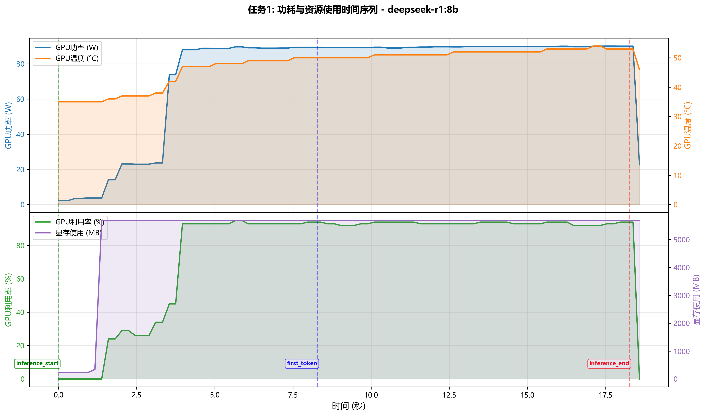

#### 任务2: 多轮对话功耗分解

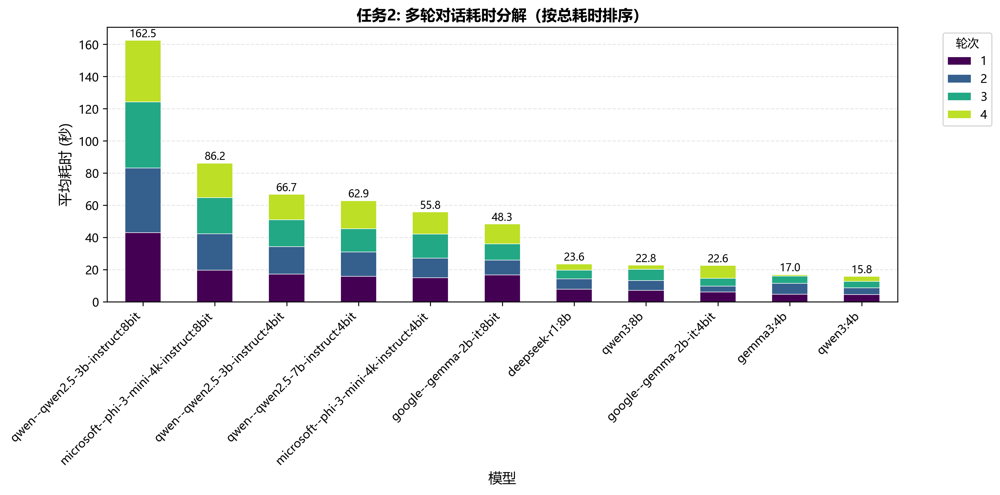

### 二、首token延迟分析

#### 任务3: TTFT分布

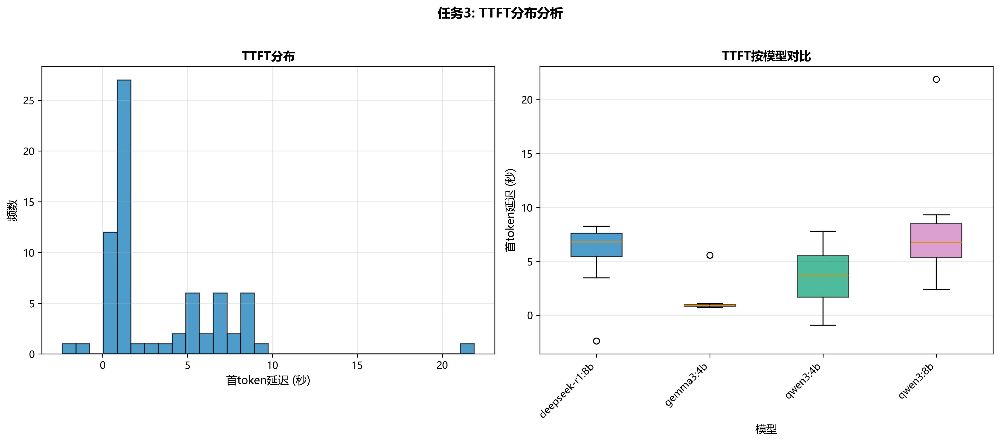

#### 任务4: TTFT与输入长度关系

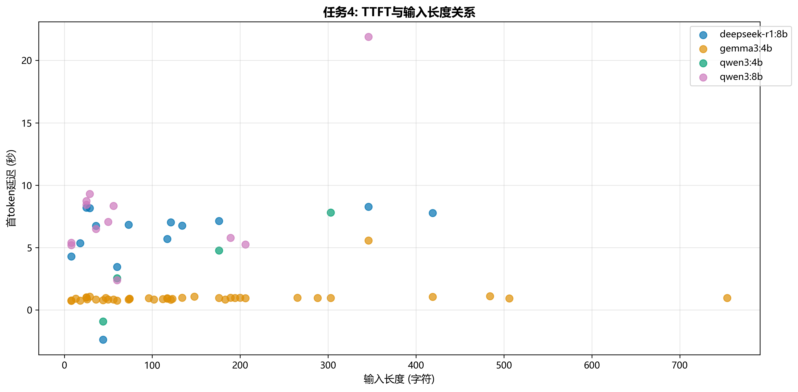

### 三、逐token生成延迟分析

#### 任务5: TPOT分布

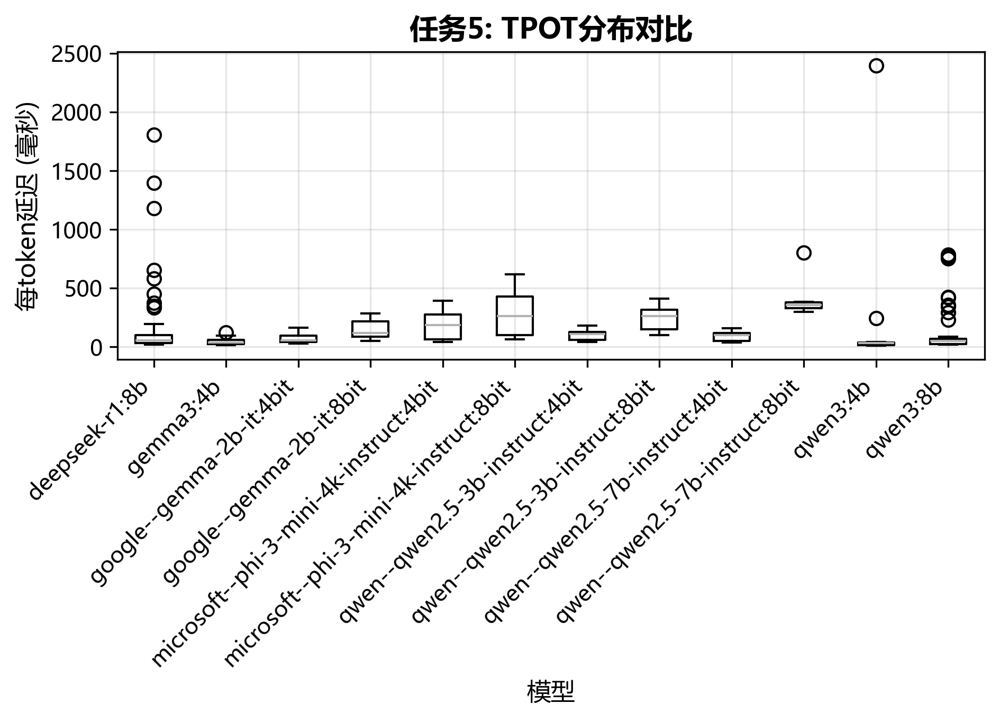

#### 任务6: 生成延迟随时间变化

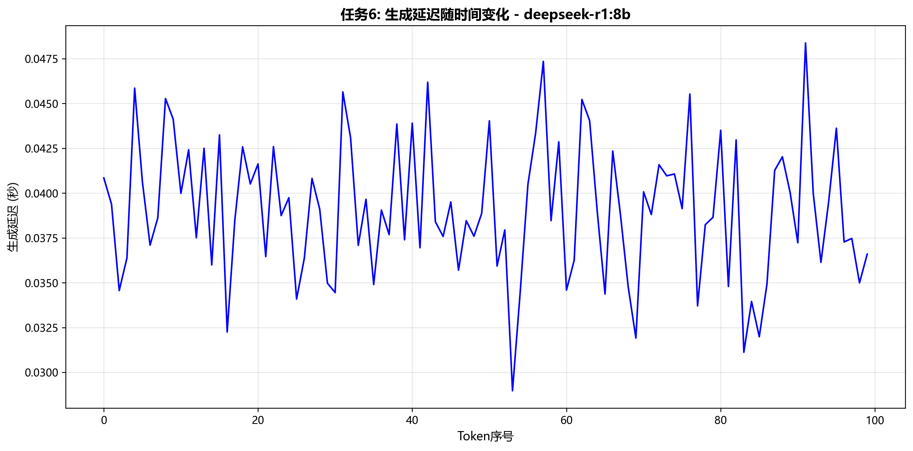

### 四、能耗分解与效率

#### 任务7: 每轮对话能耗占比

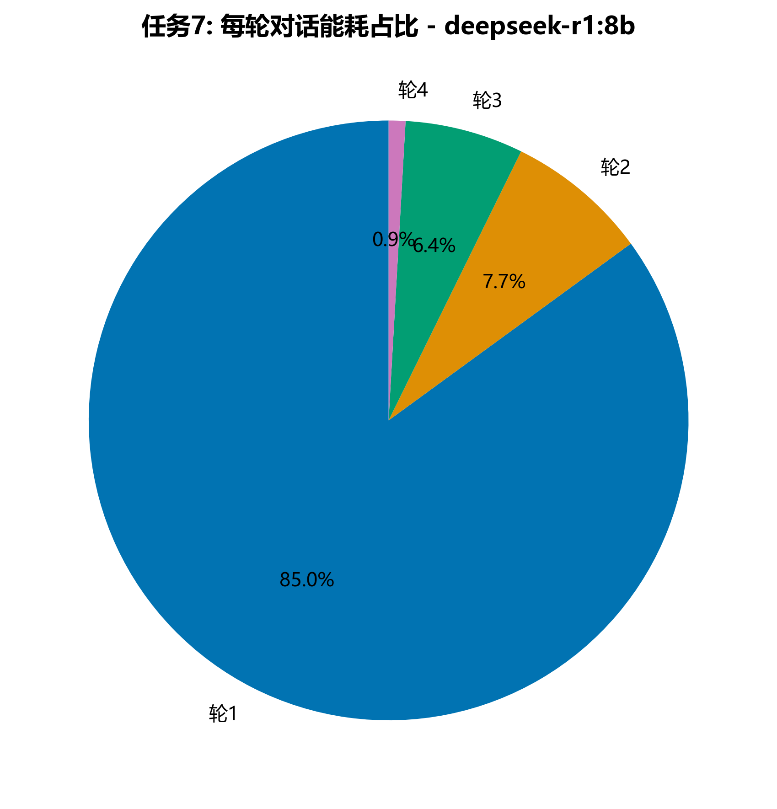

#### 任务8: 能耗与生成token数关系

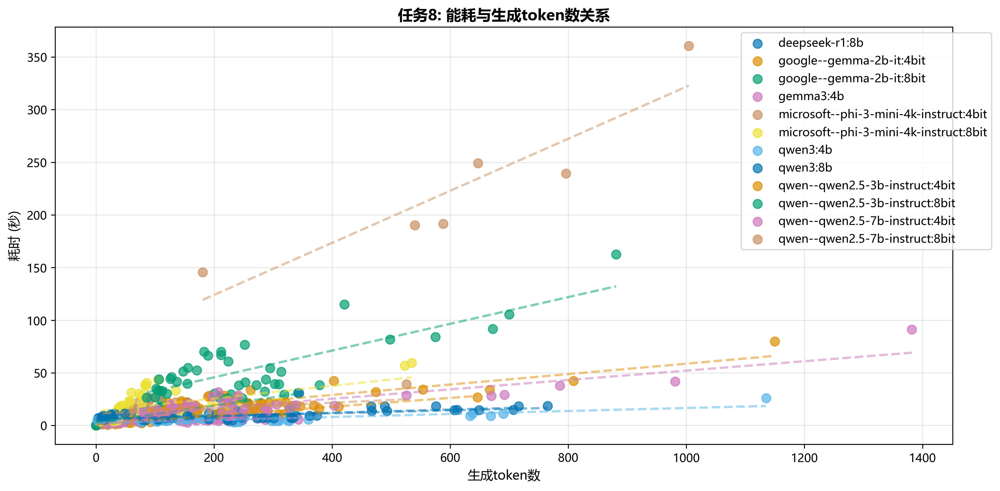

#### 任务9: 空闲功耗与工作功耗对比

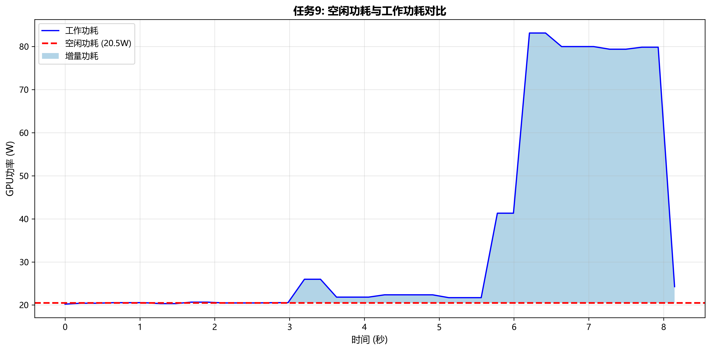

### 五、资源使用模式

#### 任务10: 显存使用随时间变化

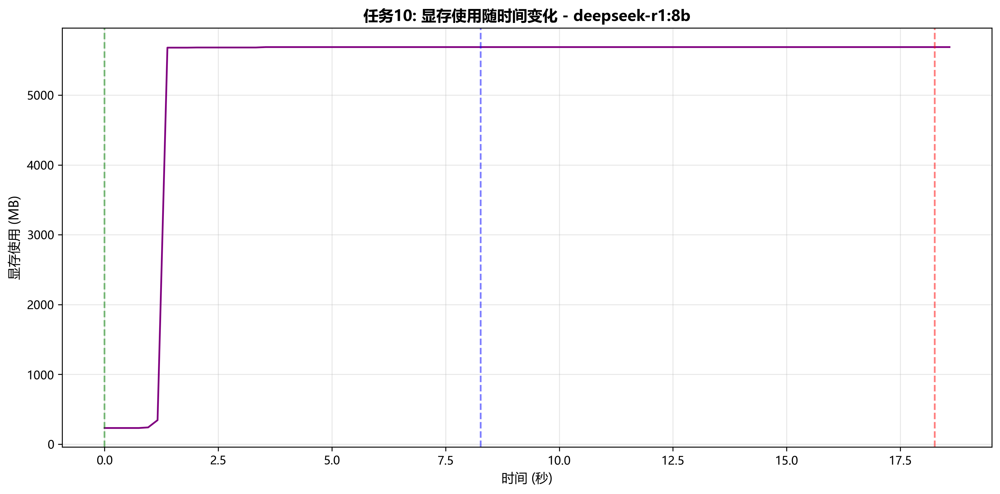

#### 任务11: GPU利用率与功耗关系

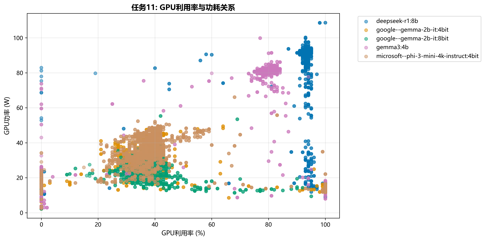

#### 任务12: 温度对功耗的影响

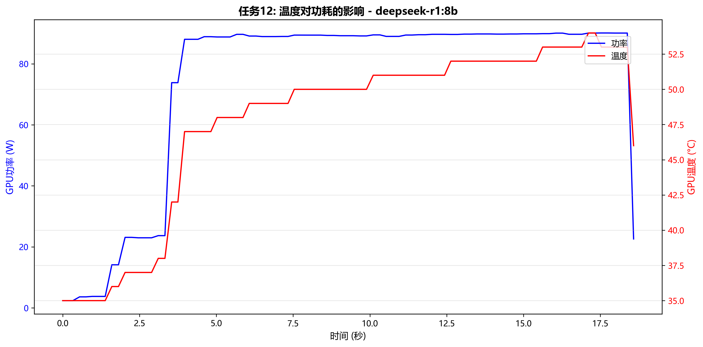

### 六、事件驱动的微观分析

#### 任务13: 事件时间线

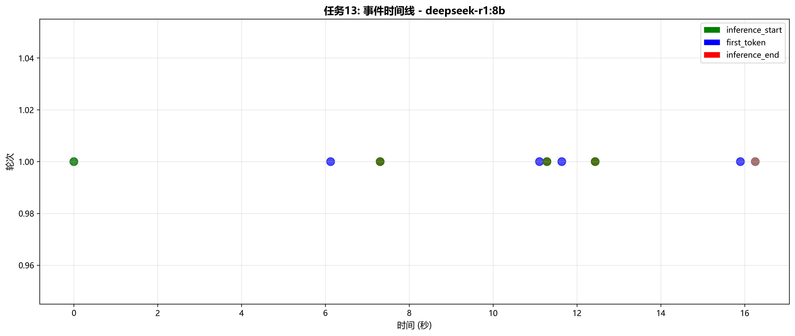

#### 任务14: 跨轮次时间对比

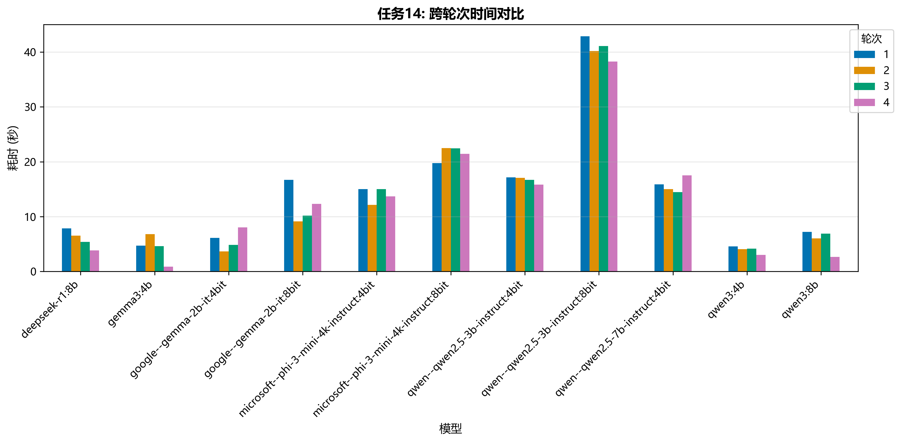

### 七、异常检测与数据质量验证

#### 任务15: 功率波动性分析

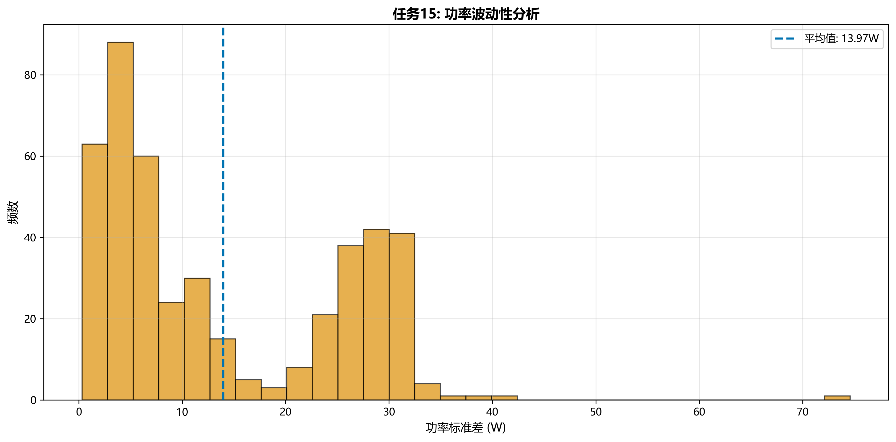

#### 任务16: 事件完整性检查

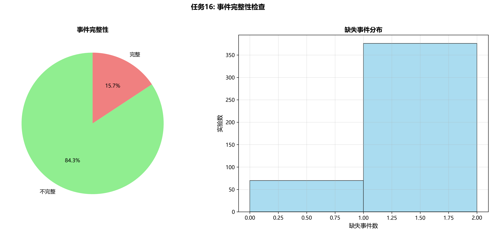

### 八、跨实验对比分析

#### 任务17: 多模型同一任务功耗曲线叠加

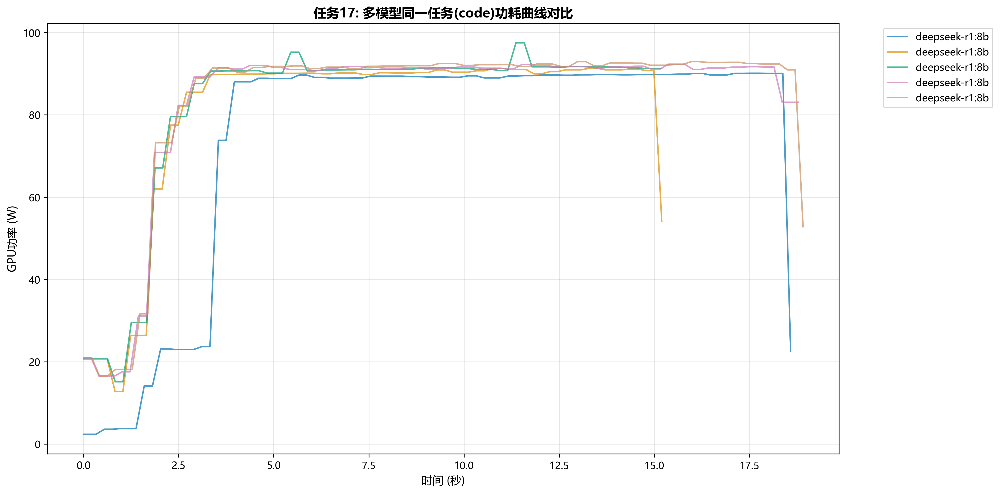

#### 任务18: 任务类型对功耗波形的影响

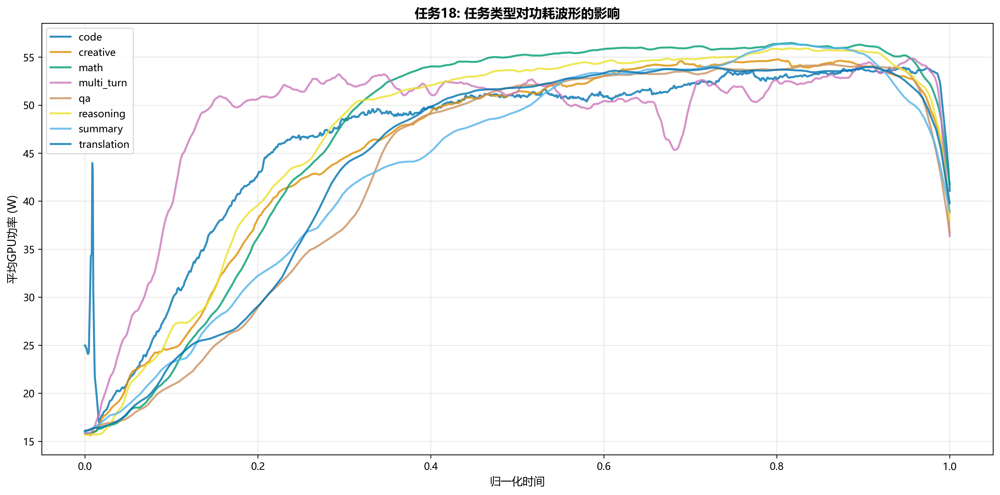

## 关键发现

### 首token延迟统计

```
                count      mean       std       min       25%       50%       75%        max
model                                                                                       
deepseek-r1:8b   14.0  5.954075  2.800701 -2.372822  5.448617  6.792700  7.619857   8.272937
gemma3:4b        40.0  1.034875  0.741466  0.736876  0.848603  0.936135  0.977382   5.573135
qwen3:4b          4.0  3.558753  3.676784 -0.910720  1.690966  3.666188  5.533975   7.813357
qwen3:8b         12.0  7.858378  4.829924  2.398297  5.357113  6.784416  8.505047  21.884139
```

## 数据质量

- 总实验数: 446
- 模型数量: 12
- 任务类型: 8

## 附录

### 数据文件

- 图表目录: `analysis\qe_research\results\raw_analysis\figures/`
- 数据表目录: `analysis\qe_research\results\raw_analysis\tables/`
- 报告目录: `analysis\qe_research\results\raw_analysis\reports/`

---

**分析完成时间**: 2026-03-06 09:28:06
