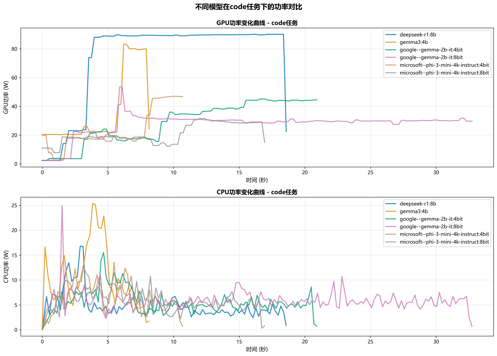
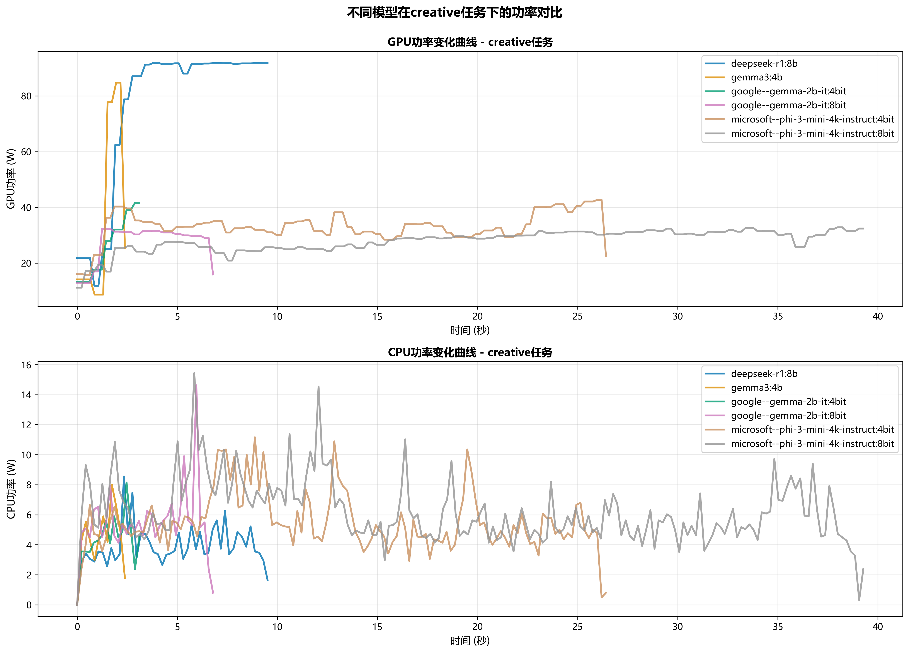
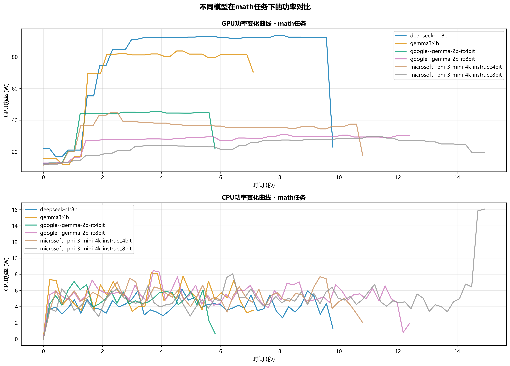
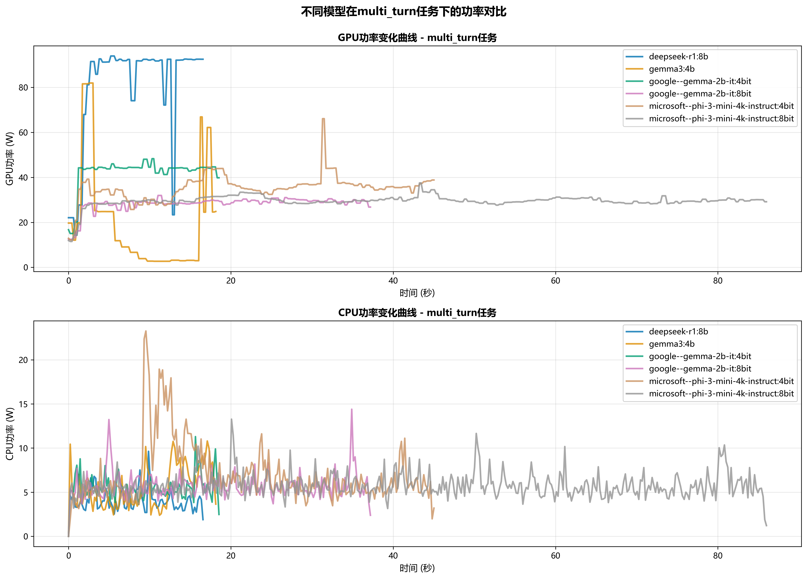
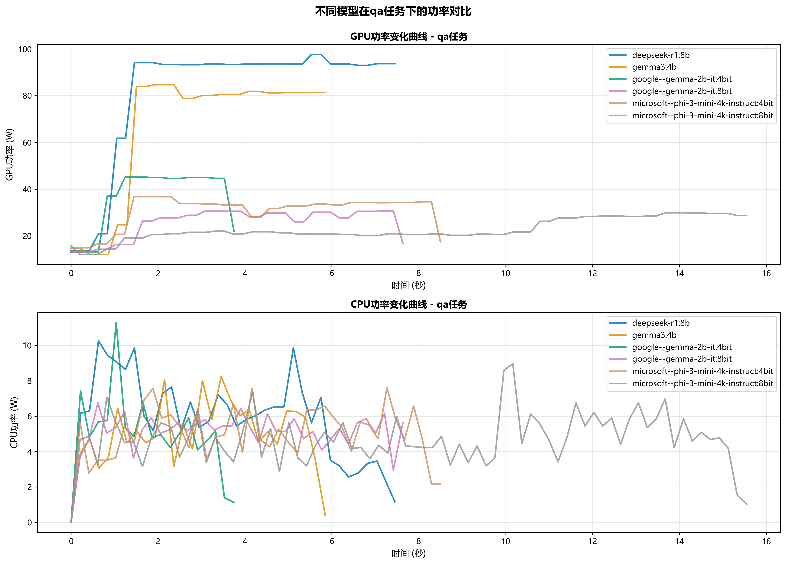
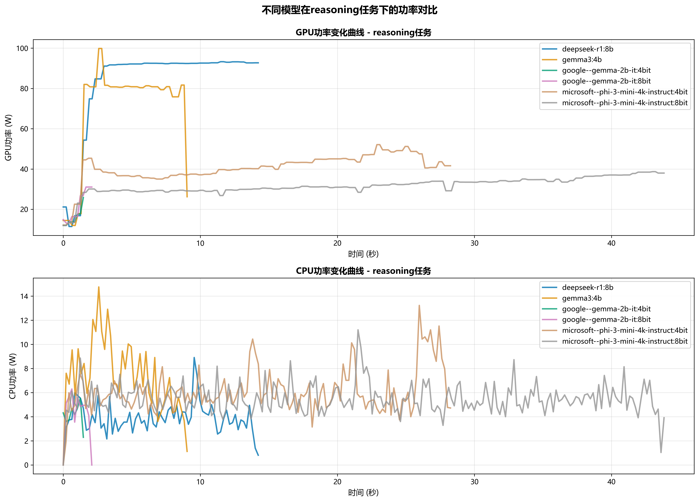
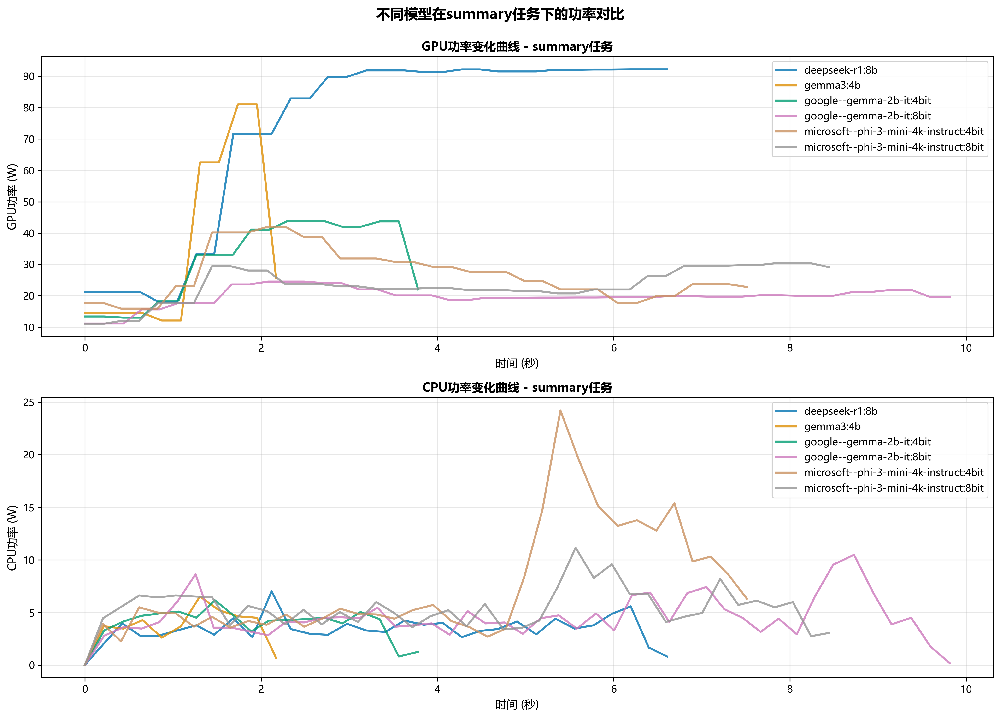
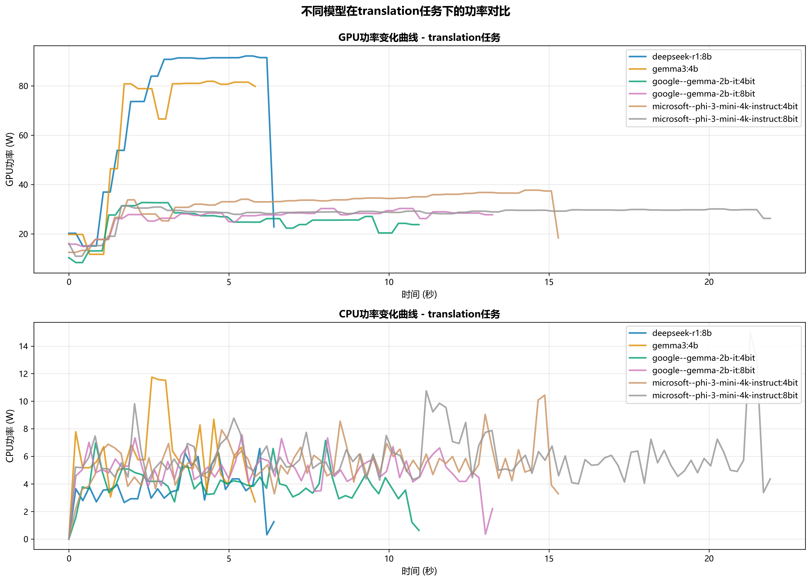
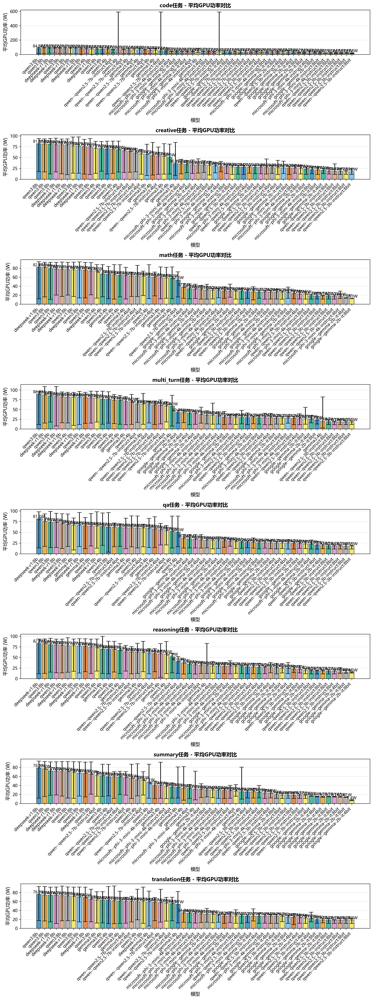

# 任务功率曲线分析报告

**生成时间**: 2026-03-06 11:05:18

---

## 分析概述

本报告分析了不同模型在各任务类型下的GPU功率消耗模式。

- 总实验数: 446
- 任务类型: code, creative, math, multi_turn, qa, reasoning, summary, translation
- 模型数量: 12

## 可视化图表

### 1. 各任务类型的功率曲线

#### code任务

#### creative任务

#### math任务

#### multi_turn任务

#### qa任务

#### reasoning任务

#### summary任务

#### translation任务

### 2. 平均功率对比

## 关键发现

1. 不同模型在相同任务下的功率消耗模式存在显著差异
2. 功率曲线反映了模型的推理效率和资源利用特征
3. 某些模型在特定任务上表现出更优的能效比

---

**报告生成时间**: 2026-03-06 11:05:18
