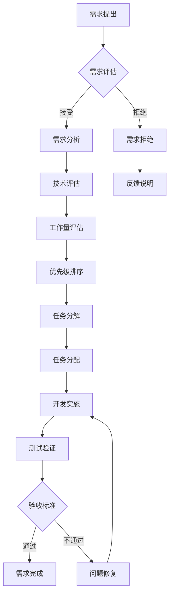

# GenAI模型能效评级体系：团队协作工作流程

## 1. 团队组织结构

### 1.1 角色分工

**项目经理 (PM)**
- 负责项目整体规划和进度管理
- 协调团队资源和任务分配
- 风险识别和问题解决
- 与外部利益相关者沟通

**技术负责人 (Tech Lead)**
- 技术架构设计和评审
- 代码质量把控和技术标准制定
- 关键技术选型和决策
- 团队技术指导和培训

**后端开发工程师**
- 后端API接口开发
- 数据库设计和优化
- 评估引擎核心算法实现
- 系统集成和部署

**前端开发工程师**
- 用户界面开发和优化
- 数据可视化组件实现
- 用户体验改进
- 前端性能优化

**数据科学家**
- 评估算法设计和实现
- 数据分析和挖掘
- 实验设计和验证
- 研究报告撰写

**测试工程师**
- 测试用例设计和执行
- 自动化测试框架搭建
- 性能测试和压力测试
- 质量保证和缺陷跟踪

**文档工程师**
- 技术文档编写和维护
- 用户手册和帮助文档
- API文档和开发指南
- 学术论文整理和排版

### 1.2 沟通矩阵

| 角色 | PM | Tech Lead | 后端 | 前端 | 数据科学家 | 测试 | 文档 |
|------|----|-----------|------|------|------------|------|------|
| PM | - | 每日 | 每周 | 每周 | 每周 | 每周 | 每周 |
| Tech Lead | 每日 | - | 每日 | 每日 | 每日 | 每周 | 每周 |
| 后端 | 每周 | 每日 | - | 每日 | 每日 | 每日 | 按需 |
| 前端 | 每周 | 每日 | 每日 | - | 按需 | 每日 | 按需 |
| 数据科学家 | 每周 | 每日 | 每日 | 按需 | - | 每周 | 每日 |
| 测试 | 每周 | 每周 | 每日 | 每日 | 每周 | - | 按需 |
| 文档 | 每周 | 每周 | 按需 | 按需 | 每日 | 按需 | - |

## 2. 开发工作流程

### 2.1 需求管理流程



### 2.2 代码开发流程

#### 2.2.1 Git工作流

**分支策略**
- `main`: 主分支，仅包含稳定代码
- `develop`: 开发分支，集成所有功能
- `feature/*`: 功能分支，单个功能开发
- `hotfix/*`: 热修复分支，紧急修复
- `release/*`: 发布分支，版本发布准备

**开发流程**
1. 从`develop`分支创建`feature`分支
2. 在`feature`分支上进行开发
3. 完成开发后提交Pull Request
4. 代码审查和自动化测试
5. 合并到`develop`分支
6. 定期发布到`main`分支

#### 2.2.2 代码提交规范

**提交信息格式**
```
<type>(<scope>): <subject>

<body>

<footer>
```

**提交类型**
- `feat`: 新功能
- `fix`: 错误修复
- `docs`: 文档更新
- `style`: 代码格式调整
- `refactor`: 代码重构
- `test`: 测试相关
- `chore`: 构建过程或辅助工具的变动

**示例**
```
feat(evaluation): 添加模型性能评估功能

实现了基于多维指标的模型性能评估算法
- 支持准确率、召回率等指标计算
- 支持自定义权重配置
- 提供可视化结果展示

Closes #123
```

### 2.3 代码审查流程

#### 2.3.1 审查标准

**功能性审查**
- 代码是否实现了预期功能
- 边界条件处理是否完善
- 错误处理是否恰当
- 性能是否满足要求

**代码质量审查**
- 代码可读性和可维护性
- 是否符合编码规范
- 是否有适当的注释
- 是否存在代码重复

**安全性审查**
- 是否存在安全漏洞
- 输入验证是否充分
- 敏感信息处理是否安全

#### 2.3.2 审查流程

1. **提交PR**: 开发者完成开发后提交Pull Request
2. **自动检查**: 自动化测试和代码质量检查
3. **分配审查者**: 系统自动分配或手动指定审查者
4. **代码审查**: 审查者进行代码审查
5. **反馈修改**: 开发者根据反馈进行修改
6. **最终确认**: 审查者确认修改完成
7. **合并代码**: 将代码合并到目标分支

## 3. 沟通协作机制

### 3.1 会议制度

#### 3.1.1 每日站会 (Daily Standup)

**时间安排**: 每个工作日上午9:30-9:45
**参与人员**: 全体开发团队成员
**会议内容**:
- 昨天完成了什么
- 今天计划做什么
- 遇到的阻碍和问题

**会议规则**:
- 严格控制时间，每人不超过2分钟
- 不讨论技术细节，仅汇报进度和问题
- 会后单独讨论具体问题

#### 3.1.2 周例会 (Weekly Meeting)

**时间安排**: 每周一上午10:00-11:00
**参与人员**: 全体团队成员
**会议内容**:
- 上周工作总结
- 本周工作计划
- 风险识别和问题讨论
- 资源需求和协调

#### 3.1.3 月度回顾 (Monthly Retrospective)

**时间安排**: 每月最后一个工作日下午
**参与人员**: 全体团队成员
**会议内容**:
- 本月目标完成情况
- 工作流程改进建议
- 团队协作反思
- 下月重点规划

### 3.2 文档协作

#### 3.2.1 文档规范

**文档类型**
- **技术文档**: 架构设计、API文档、部署指南
- **项目文档**: 需求文档、进度报告、会议纪要
- **研究文档**: 实验设计、数据分析、研究报告

**文档格式**
- 使用Markdown格式编写
- 统一文档模板和结构
- 版本控制使用Git管理
- 定期更新和维护

#### 3.2.2 文档审查

**审查流程**
1. 作者完成文档初稿
2. 指定审查者进行审查
3. 收集反馈和建议
4. 修改和完善文档
5. 最终确认和发布

**审查要点**
- 内容完整性和准确性
- 结构清晰性和逻辑性
- 语言表达和可读性
- 格式规范和一致性

### 3.3 知识分享

#### 3.3.1 技术分享会

**分享频率**: 每两周一次
**分享主题**:
- 新技术调研和应用
- 项目经验总结
- 问题解决方案
- 行业趋势分析

**分享形式**:
- 30分钟主题分享
- 15分钟互动讨论
- 录制视频供后续学习

#### 3.3.2 代码走读

**走读频率**: 每周一次
**走读内容**:
- 核心功能代码讲解
- 设计模式应用
- 性能优化技巧
- 安全最佳实践

## 4. 项目管理规范

### 4.1 任务管理

#### 4.1.1 任务分类

**按优先级分类**
- **P0 (紧急)**: 影响项目关键里程碑
- **P1 (重要)**: 影响功能完整性
- **P2 (一般)**: 优化和改进类任务
- **P3 (低优先级)**: 可选功能

**按类型分类**
- **功能开发**: 新功能实现
- **缺陷修复**: Bug修复
- **性能优化**: 性能改进
- **文档编写**: 文档相关工作
- **测试验证**: 测试相关工作

#### 4.1.2 任务状态管理

**任务状态**
- **待办 (Todo)**: 等待开始的任务
- **进行中 (In Progress)**: 正在执行的任务
- **审查中 (In Review)**: 等待审查的任务
- **已完成 (Done)**: 完成的任务
- **已阻塞 (Blocked)**: 被阻塞的任务

**状态流转规则**
```
待办 → 进行中 → 审查中 → 已完成
  ↑        ↓
  └──── 已阻塞
```

### 4.2 进度跟踪

#### 4.2.1 里程碑管理

**主要里程碑**

| 里程碑 | 计划时间 | 交付物 | 成功标准 |
|--------|----------|--------|----------|
| M1: 需求分析完成 | 第1月 | 需求文档、技术方案 | 需求文档通过评审 |
| M2: 架构设计完成 | 第2月 | 架构设计文档、原型 | 架构设计通过评审 |
| M3: 核心功能开发 | 第4月 | 评估引擎、基础API | 核心功能测试通过 |
| M4: 前后端集成 | 第6月 | 完整Web应用 | 集成测试通过 |
| M5: 实验验证 | 第8月 | 实验报告、验证结果 | 实验目标达成 |
| M6: 论文初稿 | 第10月 | 论文初稿 | 通过导师评审 |
| M7: 系统优化 | 第11月 | 优化后的系统 | 性能指标达标 |
| M8: 论文终稿 | 第12月 | 论文终稿、答辩材料 | 通过答辩 |

#### 4.2.2 燃尽图跟踪

**每日更新**
- 剩余工作量统计
- 完成工作量统计
- 预期完成时间预测

**周度分析**
- 进度偏差分析
- 风险识别和预警
- 资源调整建议

### 4.3 风险管理

#### 4.3.1 风险识别

**技术风险**
- 关键技术难度评估
- 技术方案可行性
- 第三方依赖风险
- 性能瓶颈识别

**项目风险**
- 进度延期风险
- 资源不足风险
- 需求变更风险
- 团队协作风险

#### 4.3.2 风险应对

**风险等级**
- **高风险**: 概率>70%, 影响>50%
- **中风险**: 概率30-70%, 影响20-50%
- **低风险**: 概率<30%, 影响<20%

**应对策略**
- **规避**: 改变计划避免风险
- **转移**: 将风险转移给第三方
- **缓解**: 降低风险概率或影响
- **接受**: 接受风险并制定应急计划

## 5. 质量保证体系

### 5.1 代码质量

#### 5.1.1 代码规范

**Python编码规范 (PEP 8)**
- 使用4个空格缩进
- 行长度不超过79字符
- 使用有意义的变量名
- 添加适当的注释和文档字符串

**JavaScript编码规范 (ESLint)**
- 使用2个空格缩进
- 使用单引号
- 添加分号
- 使用const/let代替var

#### 5.1.2 自动化检查

**静态代码分析**
- Pylint (Python)
- ESLint (JavaScript)
- SonarQube (代码质量平台)

**代码格式化**
- Black (Python)
- Prettier (JavaScript)
- 自动格式化提交

### 5.2 测试质量

#### 5.2.1 测试策略

**测试金字塔**
- **单元测试 (70%)**: 函数和方法级别
- **集成测试 (20%)**: 模块和组件级别
- **端到端测试 (10%)**: 系统级别

**测试覆盖率要求**
- 总体覆盖率: > 80%
- 核心模块: > 90%
- 新代码: > 85%

#### 5.2.2 测试自动化

**持续集成测试**
- 每次提交触发测试
- 多环境测试 (Python 3.8-3.11)
- 并行测试执行

**性能测试**
- 负载测试
- 压力测试
- 性能基准测试

### 5.3 文档质量

#### 5.3.1 文档标准

**完整性要求**
- 所有公共API必须有文档
- 所有功能必须有用户指南
- 所有部署必须有操作手册

**准确性要求**
- 文档与代码同步更新
- 定期审查和更新
- 版本控制和变更记录

#### 5.3.2 文档工具

**文档生成工具**
- Sphinx (Python文档)
- JSDoc (JavaScript文档)
- Swagger/OpenAPI (API文档)

**文档发布**
- 自动化文档构建
- 在线文档托管
- 版本化文档管理

## 6. 持续改进机制

### 6.1 反馈收集

#### 6.1.1 内部反馈

**团队反馈**
- 月度满意度调查
- 流程改进建议
- 技术债务识别

**代码审查反馈**
- 审查效率统计
- 常见问题分析
- 改进措施制定

#### 6.1.2 外部反馈

**用户反馈**
- 用户满意度调查
- 功能使用统计
- 问题报告分析

**社区反馈**
- 开源社区贡献
- 同行评议意见
- 学术会议反馈

### 6.2 改进实施

#### 6.2.1 改进计划

**短期改进 (1-3个月)**
- 流程优化
- 工具升级
- 技能培训

**长期改进 (3-12个月)**
- 架构重构
- 技术栈更新
- 团队建设

#### 6.2.2 改进跟踪

**改进指标**
- 开发效率提升
- 代码质量改善
- 团队协作满意度
- 项目交付质量

**定期评估**
- 月度改进回顾
- 季度效果评估
- 年度总结规划

这个协作工作流程为GenAI模型能效评级体系项目提供了完整的团队协作框架，确保项目能够高效、有序地推进，同时保证交付质量和团队满意度。