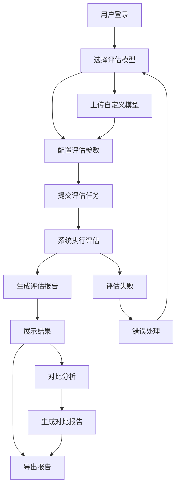
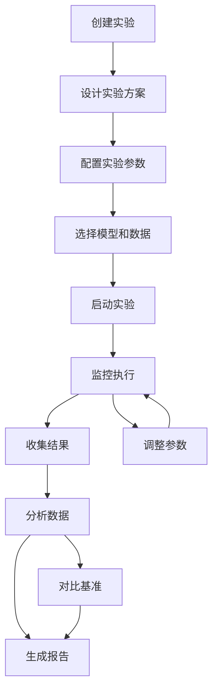
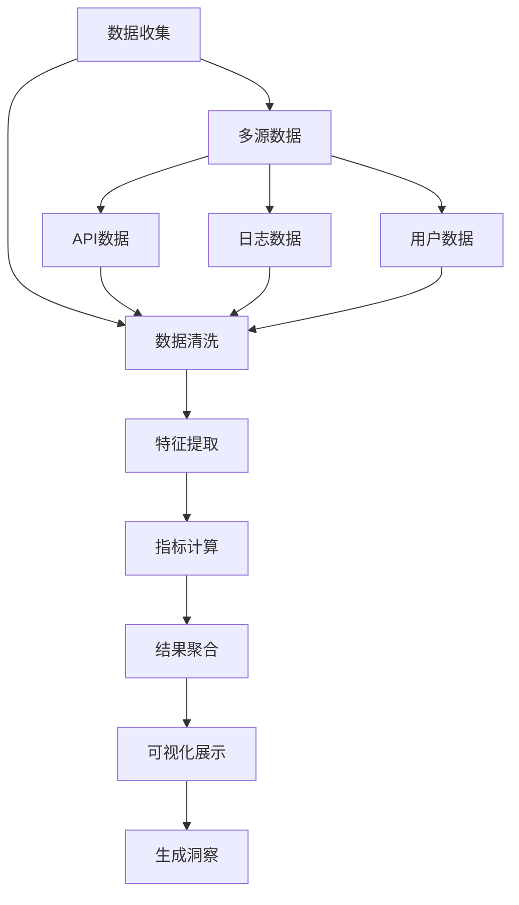

# GenAI模型能效评级体系：产品需求文档

## 1. 产品概述

本项目构建一个综合性的GenAI模型能效评级平台，通过多维度的效质比评估方法，为生成式AI模型提供标准化的性能、效率、成本和环境影响评估服务。平台服务于AI研究人员、企业决策者、投资者和政策制定者，帮助他们做出基于数据的AI模型选择和部署决策。

### 1.1 核心问题
- 缺乏统一的GenAI模型评估标准
- 模型性能与成本效益难以量化比较
- 环境影响评估缺失
- 市场价值评估缺乏科学依据

### 1.2 目标用户
- **AI研究人员**: 需要客观评估模型性能
- **企业决策者**: 需要选择最适合的AI解决方案
- **投资者**: 需要评估AI技术的投资价值
- **政策制定者**: 需要了解AI技术发展趋势

### 1.3 市场价值
构建行业标准的GenAI模型评估体系，推动AI技术健康发展，降低技术选择风险，促进可持续发展。

## 2. 核心功能

### 2.1 用户角色

| 角色 | 注册方式 | 核心权限 |
|------|----------|----------|
| 访客用户 | 无需注册 | 浏览公开评估结果和报告 |
| 普通用户 | 邮箱注册 | 使用基础评估工具，查看个人历史 |
| 专业用户 | 邮箱+审核 | 使用高级评估功能，导出详细报告 |
| 企业用户 | 企业认证 | 批量评估，API访问，定制报告 |
| 管理员 | 内部创建 | 系统管理，用户管理，数据维护 |

### 2.2 功能模块

本项目的核心功能包含以下主要模块：

1. **模型评估中心**: 多维度模型性能评估，自动化测试流程
2. **数据分析仪表板**: 实时数据可视化，趋势分析，对比分析
3. **报告生成系统**: 自动化报告生成，多种格式导出，定制化报告
4. **实验管理平台**: 实验设计，参数配置，结果管理
5. **知识库系统**: 评估标准，最佳实践，技术文档

### 2.3 页面详细设计

| 页面名称 | 模块名称 | 功能描述 |
|----------|----------|----------|
| 首页 | 概览展示 | 展示平台核心功能，最新评估结果，热门模型排行 |
| 首页 | 快速入口 | 提供评估工具快速入口，用户引导，帮助文档链接 |
| 模型评估 | 模型选择 | 选择或上传待评估模型，支持多种模型格式 |
| 模型评估 | 评估配置 | 配置评估参数，选择评估维度，设置测试数据集 |
| 模型评估 | 评估执行 | 显示评估进度，实时日志，支持评估中断和恢复 |
| 评估结果 | 结果概览 | 展示综合评分，各项指标得分，评级结果 |
| 评估结果 | 详细分析 | 展示详细评估数据，性能曲线，对比分析 |
| 评估结果 | 结果导出 | 支持PDF、Excel等格式导出，生成分享链接 |
| 数据仪表板 | 实时监控 | 实时显示系统状态，评估任务队列，资源使用情况 |
| 数据仪表板 | 趋势分析 | 展示历史趋势，性能变化，市场发展 |
| 数据仪表板 | 对比分析 | 多模型对比，时间对比，基准对比 |
| 实验管理 | 实验创建 | 创建新实验，配置实验参数，设置实验目标 |
| 实验管理 | 实验监控 | 监控实验进度，查看中间结果，调整实验参数 |
| 实验管理 | 结果分析 | 分析实验结果，生成实验报告，导出实验数据 |
| 知识库 | 评估标准 | 展示评估标准和指标体系，更新评估方法 |
| 知识库 | 技术文档 | 提供API文档，使用指南，最佳实践 |
| 用户中心 | 个人资料 | 管理个人信息，查看使用统计，设置偏好 |
| 用户中心 | 历史记录 | 查看评估历史，实验记录，导出个人数据 |
| 用户中心 | 订阅管理 | 管理订阅服务，查看使用情况，升级服务 |
| 系统管理 | 用户管理 | 管理用户账户，权限分配，用户审核 |
| 系统管理 | 系统配置 | 配置系统参数，维护评估标准，管理数据源 |
| 系统管理 | 日志监控 | 查看系统日志，监控系统状态，异常处理 |

## 3. 核心流程

### 3.1 模型评估流程

### 3.2 实验管理流程

### 3.3 数据分析流程

## 4. 用户界面设计

### 4.1 设计规范

**色彩方案**:
- 主色调: #1890FF (科技蓝)
- 辅助色: #52C41A (成功绿), #FAAD14 (警告黄), #F5222D (错误红)
- 中性色: #000000 (主文字), #595959 (次要文字), #D9D9D9 (边框)

**字体选择**:
- 主要字体: -apple-system, BlinkMacSystemFont, 'Segoe UI', 'PingFang SC', 'Hiragino Sans GB', 'Microsoft YaHei'
- 标题字体: 18px, 16px, 14px (递减)
- 正文字体: 14px
- 辅助文字: 12px

**按钮风格**:
- 主要按钮: 圆角4px, 填充主色调
- 次要按钮: 圆角4px, 边框样式
- 幽灵按钮: 透明背景, 悬停效果

**布局风格**:
- 卡片式布局, 间距8px网格系统
- 响应式设计, 支持1200px-1920px
- 左侧导航 + 右侧内容区域

**图标风格**:
- 使用Ant Design图标库
- 线性图标为主, 面性图标为辅
- 统一尺寸: 16px, 20px, 24px

### 4.2 页面设计详述

| 页面名称 | 模块名称 | UI元素设计 |
|----------|----------|------------|
| 首页 | 导航栏 | 顶部固定导航,包含Logo、主导航菜单、用户头像,背景白色,阴影效果 |
| 首页 | Hero区域 | 全宽背景图,渐变遮罩,大标题文字,副标题,主要CTA按钮,向下滚动指示器 |
| 首页 | 功能卡片 | 网格布局,3列卡片,每个卡片包含图标、标题、描述、操作按钮,悬停上浮效果 |
| 首页 | 数据展示 | 数字滚动动画,统计卡片,图表展示,使用渐变色增强视觉效果 |
| 模型评估 | 步骤指示器 | 横向步骤条,当前步骤高亮,完成步骤显示勾选,支持点击跳转 |
| 模型评估 | 模型选择 | 卡片式模型展示,搜索框,分类筛选,分页加载,选中状态明显 |
| 模型评估 | 参数配置 | 分组表单,折叠面板,输入验证,实时预览,帮助提示 |
| 评估结果 | 评分展示 | 大数字评分,星级显示,进度条,颜色编码(红-黄-绿渐变) |
| 评估结果 | 图表区域 | 标签页切换,多种图表类型,交互式图例,数据点提示 |
| 数据仪表板 | 筛选器 | 顶部筛选栏,日期范围选择,下拉选择器,实时筛选 |
| 数据仪表板 | 图表网格 | 响应式网格,拖拽调整大小,全屏查看,导出功能 |
| 实验管理 | 实验列表 | 表格展示,状态标签,进度条,操作按钮,批量操作 |
| 实验管理 | 详情面板 | 侧边抽屉,分标签展示,实时更新,操作日志 |

### 4.3 响应式设计

**桌面优先设计**:
- 基础分辨率: 1920x1080
- 支持分辨率: 1366x768 到 2560x1440
- 最大内容宽度: 1200px (居中显示)

**平板适配**:
- 断点: 768px-1024px
- 导航转换为汉堡菜单
- 网格布局调整为2列
- 表格横向滚动

**手机适配**:
- 断点: < 768px
- 单列布局
- 底部导航栏
- 触摸优化: 按钮最小44px
- 手势支持: 滑动切换, 下拉刷新

**交互优化**:
- 加载状态: 骨架屏, 加载动画
- 空状态: 友好提示, 操作引导
- 错误处理: 错误提示, 重试机制
- 反馈机制: 操作成功提示, 进度显示

## 5. 非功能性需求

### 5.1 性能要求
- 页面加载时间: < 3秒
- API响应时间: < 500ms
- 并发用户数: 支持1000+同时在线
- 数据处理量: 支持TB级数据处理

### 5.2 可用性要求
- 系统可用性: 99.9%
- 数据备份: 每日自动备份
- 故障恢复: < 30分钟
- 维护窗口: 每周日凌晨2-4点

### 5.3 安全要求
- 数据加密: 传输和存储加密
- 访问控制: 基于角色的权限管理
- 审计日志: 完整的操作记录
- 安全认证: 支持OAuth 2.0, 双因素认证

### 5.4 兼容性要求
- 浏览器支持: Chrome 80+, Firefox 75+, Safari 13+, Edge 80+
- 移动端支持: iOS 12+, Android 8+
- API兼容性: 向后兼容3个版本
- 数据格式: 支持JSON, CSV, Excel导出

这个产品需求文档为GenAI模型能效评级体系项目提供了详细的功能规划和设计指导，确保项目能够满足不同用户群体的需求，并提供优秀的用户体验。