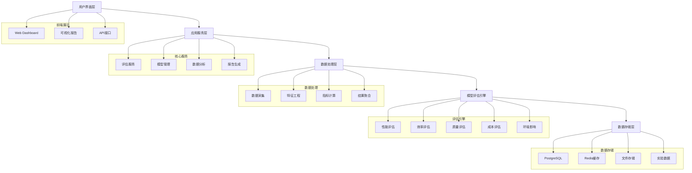

# GenAI模型能效评级体系构建：技术架构文档

## 1. 项目概述

本项目旨在构建一个全面的GenAI模型能效评级体系，通过多维效质比评估方法，对生成式AI模型的性能、效率、成本、环境影响等关键指标进行量化分析，并建立市场价值评估模型。

### 1.1 研究目标
- 构建多维效质比评估框架
- 开发自动化评估工具
- 建立市场价值分析模型
- 提供可视化决策支持系统

### 1.2 技术愿景
构建一个开源、可扩展的GenAI模型评估平台，为研究人员、开发者和企业提供标准化的模型评估服务。

## 2. 架构设计



## 3. 技术栈选择

### 3.1 核心技术
- **编程语言**: Python 3.9+ (主要), JavaScript/TypeScript (前端)
- **Web框架**: FastAPI (后端), React 18 (前端)
- **数据库**: PostgreSQL 14+ (主数据库), Redis (缓存)
- **机器学习**: scikit-learn, PyTorch, Transformers
- **数据处理**: pandas, numpy, scipy
- **可视化**: matplotlib, seaborn, plotly, D3.js
- **文档处理**: LaTeX, Markdown, Jupyter Notebook

### 3.2 开发工具
- **版本控制**: Git + GitHub
- **依赖管理**: pipenv (Python), npm/yarn (JavaScript)
- **测试框架**: pytest, unittest
- **代码质量**: black, flake8, mypy, pre-commit
- **CI/CD**: GitHub Actions
- **容器化**: Docker, Docker Compose

## 4. 目录结构设计

```
GenAI_power_analize/
├── docs/                           # 文档目录
│   ├── academic/                   # 学术论文相关
│   │   ├── paper/                    # 论文正文
│   │   ├── references/               # 参考文献
│   │   ├── figures/                  # 图表文件
│   │   └── templates/                # 论文模板
│   ├── technical/                  # 技术文档
│   │   ├── api/                      # API文档
│   │   ├── architecture/             # 架构设计
│   │   └── deployment/               # 部署指南
│   └── collaboration/              # 协作文档
│       ├── guidelines/               # 贡献指南
│       ├── meeting_notes/            # 会议记录
│       └── progress_reports/         # 进度报告
├── src/                            # 源代码
│   ├── backend/                    # 后端服务
│   │   ├── api/                      # API接口
│   │   ├── core/                     # 核心逻辑
│   │   ├── models/                   # 数据模型
│   │   ├── services/                 # 业务服务
│   │   └── utils/                    # 工具函数
│   ├── frontend/                   # 前端应用
│   │   ├── components/               # React组件
│   │   ├── pages/                    # 页面组件
│   │   ├── services/                 # 前端服务
│   │   └── styles/                   # 样式文件
│   ├── evaluation/                 # 评估引擎
│   │   ├── metrics/                  # 评估指标
│   │   ├── benchmarks/               # 基准测试
│   │   ├── algorithms/               # 评估算法
│   │   └── pipelines/                # 评估流程
│   └── data/                       # 数据处理
│       ├── collectors/               # 数据采集器
│       ├── processors/               # 数据处理器
│       └── generators/               # 数据生成器
├── experiments/                    # 实验设计
│   ├── configs/                      # 实验配置
│   ├── notebooks/                    # Jupyter笔记本
│   ├── scripts/                      # 实验脚本
│   └── results/                      # 实验结果
├── tests/                          # 测试代码
│   ├── unit/                         # 单元测试
│   ├── integration/                  # 集成测试
│   └── e2e/                          # 端到端测试
├── configs/                        # 配置文件
├── scripts/                        # 脚本文件
├── tools/                          # 工具脚本
└── .github/                        # GitHub配置
    ├── workflows/                    # CI/CD工作流
    └── ISSUE_TEMPLATE/              # 问题模板
```

## 5. 核心模块设计

### 5.1 评估引擎模块
- **性能评估**: 响应时间、吞吐量、并发处理能力
- **质量评估**: 准确性、相关性、创新性、多样性
- **效率评估**: 资源利用率、能耗、成本效益
- **环境影响**: 碳足迹、能源消耗、可持续性

### 5.2 数据收集模块
- **API监控**: 实时监控模型API性能
- **日志分析**: 收集和分析系统日志
- **用户反馈**: 收集用户体验数据
- **市场数据**: 获取市场价格和趋势数据

### 5.3 分析算法模块
- **多维评估算法**: 综合评分算法
- **权重优化**: 自适应权重调整
- **趋势分析**: 时间序列分析
- **预测模型**: 性能预测和价值预测

## 6. 团队协作流程

### 6.1 开发流程
1. **需求分析**: 明确研究目标和功能需求
2. **设计阶段**: 架构设计和接口定义
3. **开发阶段**: 功能实现和单元测试
4. **测试阶段**: 集成测试和性能测试
5. **文档编写**: 技术文档和用户手册
6. **代码审查**: 同行评审和质量检查
7. **发布部署**: 版本发布和部署上线

### 6.2 分支策略
- **main**: 主分支，稳定版本
- **develop**: 开发分支，集成开发
- **feature/***: 功能分支，新功能开发
- **hotfix/***: 热修复分支，紧急修复
- **release/***: 发布分支，版本发布

### 6.3 代码规范
- 遵循PEP 8 Python编码规范
- 使用类型注解和文档字符串
- 编写单元测试和集成测试
- 代码审查和静态分析
- 持续集成和自动化测试

## 7. 版本控制策略

### 7.1 Git工作流
- 使用Git Flow工作流模型
- 定期合并和冲突解决
- 标签管理和版本发布
- 代码审查和合并请求

### 7.2 版本管理
- 语义化版本号 (Semantic Versioning)
- 主版本号.次版本号.修订号 (MAJOR.MINOR.PATCH)
- 预发布版本和构建元数据
- 变更日志和发布说明

### 7.3 备份策略
- 定期备份代码仓库
- 多地点备份和容灾
- 数据完整性检查
- 恢复测试和验证

## 8. 研究进度管理

### 8.1 里程碑规划
- **M1 (第1-2月)**: 需求分析和架构设计
- **M2 (第3-4月)**: 核心模块开发
- **M3 (第5-6月)**: 评估算法实现
- **M4 (第7-8月)**: 系统集成和测试
- **M5 (第9-10月)**: 实验验证和优化
- **M6 (第11-12月)**: 论文撰写和发布

### 8.2 任务管理
- 使用GitHub Issues跟踪任务
- 项目看板和进度可视化
- 定期会议和进度汇报
- 风险识别和应对措施

### 8.3 质量保证
- 代码审查和静态分析
- 自动化测试和持续集成
- 文档完整性和准确性
- 用户反馈和持续改进

## 9. 部署和运维

### 9.1 部署方案
- Docker容器化部署
- Kubernetes集群管理
- 自动化部署脚本
- 蓝绿部署和滚动更新

### 9.2 监控告警
- 系统性能监控
- 应用日志分析
- 错误告警和通知
- 性能指标和趋势分析

### 9.3 安全策略
- 访问控制和身份认证
- 数据加密和隐私保护
- 安全审计和漏洞扫描
- 备份恢复和灾难恢复

## 10. 后续规划

### 10.1 扩展计划
- 支持更多模型类型
- 增加评估维度
- 优化算法性能
- 扩展数据源

### 10.2 社区建设
- 开源代码和文档
- 社区贡献指南
- 技术交流和分享
- 合作伙伴生态

这个技术架构文档为GenAI模型能效评级体系项目提供了全面的技术指导和实施蓝图，确保项目能够高效、规范地推进。