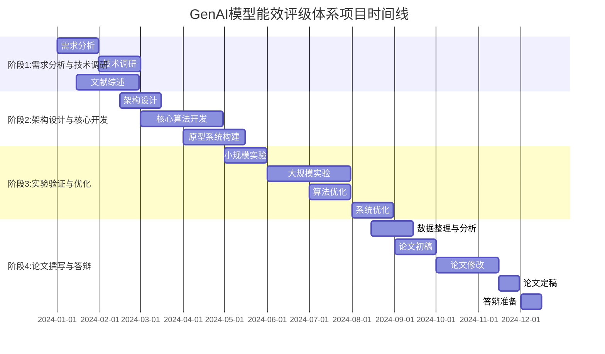
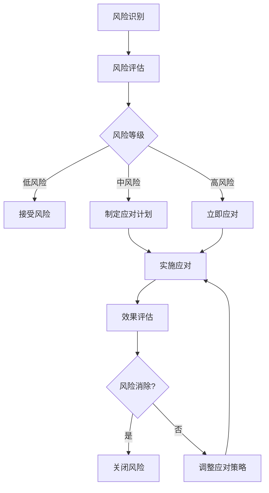

# GenAI模型能效评级体系 - 研究进度管理方案

## 📋 概述

本方案旨在为《GenAI模型能效评级体系构建：基于多维效质比的评估与市场价值分析》学术研究项目提供完整的进度管理框架，确保项目按时、高质量完成。

## 🎯 项目总览

### 项目信息
- **项目名称**: GenAI模型能效评级体系构建
- **研究主题**: 基于多维效质比的评估与市场价值分析
- **项目周期**: 12个月
- **团队规模**: 8-10人
- **预算**: 待定
- **预期成果**: 学术论文、开源系统、评估标准

### 研究目标
1. 构建GenAI模型能效评估的理论框架
2. 开发多维效质比评估算法
3. 实现自动化评估系统
4. 进行大规模实证研究
5. 发表高质量学术论文
6. 制定行业标准建议

## 📅 总体时间规划

### 项目时间线（12个月）



## 🎯 详细里程碑计划

### 第一阶段：需求分析与技术调研（第1-3个月）

#### 里程碑1.1：项目启动与团队组建（第1个月）
**时间**: 2024年1月1日 - 2024年1月31日
**负责人**: 项目经理
**目标**: 完成项目启动和团队组建

**具体任务**:
- [ ] 项目立项申请与审批
- [ ] 研究团队组建（8-10人）
- [ ] 角色分工与职责定义
- [ ] 项目章程制定
- [ ] 初始风险评估
- [ ] 项目启动会议

**成功标准**:
- ✅ 团队组建完成，成员到位率100%
- ✅ 项目章程获得批准
- ✅ 角色分工明确，责任矩阵建立
- ✅ 项目管理系统部署完成

**交付物**:
- 📄 项目章程
- 📄 团队组织架构图
- 📄 角色职责说明书
- 📄 项目启动会议纪要

#### 里程碑1.2：需求分析与范围定义（第1-2个月）
**时间**: 2024年1月15日 - 2024年2月15日
**负责人**: 需求分析师
**目标**: 明确项目需求和范围边界

**具体任务**:
- [ ] 利益相关者识别与分析
- [ ] 需求收集与整理（功能/非功能需求）
- [ ] 用户故事编写
- [ ] 需求优先级排序
- [ ] 范围边界定义
- [ ] 验收标准制定

**成功标准**:
- ✅ 完成需求规格说明书
- ✅ 需求覆盖率≥95%
- ✅ 需求优先级明确
- ✅ 验收标准获得确认

**交付物**:
- 📄 需求规格说明书
- 📄 用户故事文档
- 📄 需求跟踪矩阵
- 📄 验收标准文档

#### 里程碑1.3：技术调研与可行性分析（第2-3个月）
**时间**: 2024年2月1日 - 2024年3月15日
**负责人**: 技术负责人
**目标**: 完成技术调研和可行性分析

**具体任务**:
- [ ] GenAI模型评估技术调研
- [ ] 能效评估方法研究
- [ ] 多维效质比算法调研
- [ ] 相关工具平台分析
- [ ] 技术可行性评估
- [ ] 技术选型建议

**成功标准**:
- ✅ 技术调研报告完成
- ✅ 技术可行性分析通过评审
- ✅ 技术选型方案确定
- ✅ 技术风险评估完成

**交付物**:
- 📄 技术调研报告
- 📄 技术可行性分析报告
- 📄 技术选型建议书
- 📄 技术风险评估报告

#### 里程碑1.4：文献综述与理论基础（第1-3个月）
**时间**: 2024年1月1日 - 2024年3月31日
**负责人**: 研究负责人
**目标**: 建立项目理论基础

**具体任务**:
- [ ] 相关文献收集（≥200篇）
- [ ] 文献分类与整理
- [ ] 理论基础梳理
- [ ] 研究空白识别
- [ ] 理论框架构建
- [ ] 文献综述撰写

**成功标准**:
- ✅ 文献收集数量≥200篇
- ✅ 文献综述报告完成
- ✅ 理论框架建立
- ✅ 研究创新点明确

**交付物**:
- 📄 文献综述报告
- 📄 理论框架文档
- 📄 研究创新点分析
- 📄 参考文献库

### 第二阶段：架构设计与核心开发（第3-6个月）

#### 里程碑2.1：系统架构设计（第3-4个月）
**时间**: 2024年3月1日 - 2024年4月15日
**负责人**: 架构师
**目标**: 完成系统架构设计

**具体任务**:
- [ ] 系统需求分析
- [ ] 架构模式选择
- [ ] 模块划分与接口设计
- [ ] 数据流设计
- [ ] 技术栈确定
- [ ] 架构文档编写

**成功标准**:
- ✅ 架构设计文档完成
- ✅ 架构评审通过
- ✅ 技术栈确定
- ✅ 接口规范制定

**交付物**:
- 📄 系统架构设计文档
- 📄 模块设计文档
- 📄 接口规范文档
- 📄 技术栈说明

#### 里程碑2.2：核心算法开发（第4-6个月）
**时间**: 2024年4月1日 - 2024年6月30日
**负责人**: 算法工程师
**目标**: 开发核心评估算法

**具体任务**:
- [ ] 多维效质比算法设计
- [ ] 能效评估算法实现
- [ ] 性能优化算法开发
- [ ] 算法单元测试
- [ ] 算法性能测试
- [ ] 算法文档编写

**成功标准**:
- ✅ 核心算法实现完成
- ✅ 算法测试覆盖率≥90%
- ✅ 算法性能满足要求
- ✅ 算法文档完整

**交付物**:
- 📄 算法设计文档
- 🧮 算法实现代码
- 📊 算法测试报告
- 📈 算法性能评估报告

#### 里程碑2.3：原型系统构建（第5-6个月）
**时间**: 2024年5月1日 - 2024年6月30日
**负责人**: 开发团队
**目标**: 构建可运行的原型系统

**具体任务**:
- [ ] 后端服务开发
- [ ] 前端界面开发
- [ ] 数据库设计与实现
- [ ] API接口开发
- [ ] 系统集成测试
- [ ] 原型系统部署

**成功标准**:
- ✅ 原型系统功能完整
- ✅ 系统集成测试通过
- ✅ 原型系统可正常运行
- ✅ 用户验收测试通过

**交付物**:
- 🖥️ 原型系统
- 📄 系统设计文档
- 🧪 测试报告
- 📦 部署文档

### 第三阶段：实验验证与优化（第6-10个月）

#### 里程碑3.1：小规模实验（第6-7个月）
**时间**: 2024年6月1日 - 2024年7月31日
**负责人**: 实验负责人
**目标**: 完成小规模实验验证

**具体任务**:
- [ ] 实验设计制定
- [ ] 测试数据集准备
- [ ] 实验环境搭建
- [ ] 小规模实验执行
- [ ] 实验数据收集
- [ ] 初步结果分析

**成功标准**:
- ✅ 实验设计评审通过
- ✅ 小规模实验完成
- ✅ 实验数据质量达标
- ✅ 初步结果符合预期

**交付物**:
- 📄 实验设计方案
- 📊 实验数据
- 📈 实验结果报告
- 🔍 问题分析报告

#### 里程碑3.2：大规模实验（第7-9个月）
**时间**: 2024年7月1日 - 2024年9月30日
**负责人**: 实验负责人
**目标**: 完成大规模实验验证

**具体任务**:
- [ ] 大规模数据集准备
- [ ] 实验环境扩展
- [ ] 大规模实验执行
- [ ] 实验数据管理
- [ ] 结果统计分析
- [ ] 实验报告撰写

**成功标准**:
- ✅ 大规模实验完成
- ✅ 实验数据规模达标（≥100个模型）
- ✅ 统计分析结果显著
- ✅ 实验报告评审通过

**交付物**:
- 📊 大规模实验数据
- 📈 统计分析报告
- 📄 实验验证报告
- 📑 研究假设验证结果

#### 里程碑3.3：算法优化（第8-9个月）
**时间**: 2024年8月1日 - 2024年9月30日
**负责人**: 算法团队
**目标**: 基于实验结果优化算法

**具体任务**:
- [ ] 算法性能分析
- [ ] 瓶颈识别与优化
- [ ] 算法参数调优
- [ ] 优化算法实现
- [ ] 优化效果验证
- [ ] 算法文档更新

**成功标准**:
- ✅ 算法性能提升≥20%
- ✅ 优化效果验证通过
- ✅ 算法稳定性达标
- ✅ 算法文档更新完成

**交付物**:
- 📈 算法优化报告
- 🧮 优化算法代码
- 📊 性能对比分析
- 📄 算法文档更新

#### 里程碑3.4：系统优化（第9-10个月）
**时间**: 2024年9月1日 - 2024年10月31日
**负责人**: 开发团队
**目标**: 完成系统性能优化

**具体任务**:
- [ ] 系统性能分析
- [ ] 性能瓶颈识别
- [ ] 系统架构优化
- [ ] 代码性能优化
- [ ] 数据库优化
- [ ] 缓存策略优化

**成功标准**:
- ✅ 系统性能提升≥30%
- ✅ 响应时间达标（<2秒）
- ✅ 并发处理能力提升
- ✅ 系统稳定性达标

**交付物**:
- 📈 系统性能报告
- 🔧 优化代码
- 📊 性能对比分析
- 📄 系统优化文档

### 第四阶段：论文撰写与答辩（第10-12个月）

#### 里程碑4.1：数据整理与分析（第10个月）
**时间**: 2024年10月1日 - 2024年10月31日
**负责人**: 数据分析团队
**目标**: 完成研究数据整理与分析

**具体任务**:
- [ ] 数据清洗与整理
- [ ] 描述性统计分析
- [ ] 推断性统计分析
- [ ] 可视化图表制作
- [ ] 分析结果解释
- [ ] 数据质量评估

**成功标准**:
- ✅ 数据质量评估通过
- ✅ 统计分析完成
- ✅ 可视化图表制作完成
- ✅ 分析结果解释合理

**交付物**:
- 📊 数据分析报告
- 📈 可视化图表集
- 📄 数据质量评估报告
- 📑 分析结果解释文档

#### 里程碑4.2：论文初稿撰写（第11个月）
**时间**: 2024年11月1日 - 2024年11月30日
**负责人**: 论文撰写团队
**目标**: 完成论文初稿

**具体任务**:
- [ ] 论文结构设计
- [ ] 摘要撰写
- [ ] 引言部分撰写
- [ ] 相关工作综述
- [ ] 方法论描述
- [ ] 实验结果呈现
- [ ] 讨论与分析
- [ ] 结论撰写

**成功标准**:
- ✅ 论文初稿完成（≥8000字）
- ✅ 论文结构完整
- ✅ 内容逻辑清晰
- ✅ 引用格式规范

**交付物**:
- 📄 论文初稿
- 📚 参考文献列表
- 🖼️ 论文图表
- 📊 论文数据

#### 里程碑4.3：论文修改与完善（第11-12个月）
**时间**: 2024年11月15日 - 2024年12月31日
**负责人**: 论文撰写团队
**目标**: 完成论文修改与定稿

**具体任务**:
- [ ] 内部评审反馈处理
- [ ] 导师修改建议处理
- [ ] 同行评议意见处理
- [ ] 语言润色与校对
- [ ] 格式调整与优化
- [ ] 最终版本确认

**成功标准**:
- ✅ 论文修改完成
- ✅ 内部评审通过
- ✅ 语言质量达标
- ✅ 格式符合要求

**交付物**:
- 📄 论文修改稿
- 📄 修改说明文档
- 📄 论文定稿
- 📄 答辩PPT初稿

#### 里程碑4.4：答辩准备与执行（第12个月）
**时间**: 2024年12月1日 - 2024年12月31日
**负责人**: 答辩团队
**目标**: 完成论文答辩

**具体任务**:
- [ ] 答辩PPT制作
- [ ] 答辩演练
- [ ] 答辩材料准备
- [ ] 正式答辩
- [ ] 答辩后修改
- [ ] 论文最终提交

**成功标准**:
- ✅ 答辩PPT制作完成
- ✅ 正式答辩通过
- ✅ 答辩后修改完成
- ✅ 论文最终提交

**交付物**:
- 📊 答辩PPT
- 🎤 答辩录像
- 📄 答辩决议
- 📄 最终论文

## 📊 进度跟踪机制

### 日常跟踪

#### 每日站会（Daily Standup）
- **时间**: 每天上午9:00-9:15
- **参与人员**: 核心团队成员
- **内容**: 
  - 昨天完成了什么？
  - 今天计划做什么？
  - 遇到了什么阻碍？
- **工具**: Microsoft Teams / 钉钉
- **记录**: 会议纪要文档

#### 工作日志
- **频率**: 每日
- **内容**: 详细工作记录、时间花费、问题与解决方案
- **工具**: Notion / 飞书文档
- **审核**: 每周五由项目经理审核

### 周度跟踪

#### 周例会（Weekly Review）
- **时间**: 每周五下午3:00-4:00
- **参与人员**: 全体团队成员
- **内容**:
  - 本周工作进展回顾
  - 下周工作计划
  - 问题与风险讨论
  - 资源需求评估
- **输出**: 周报文档

#### 周进度报告
**报告内容**:
- 📈 本周完成的主要工作
- 📊 关键指标达成情况
- ⚠️ 遇到的问题与风险
- 🎯 下周工作计划
- 📋 资源需求

**模板**:
```markdown
# 第X周进度报告（日期范围）

## 本周完成
- [ ] 任务1（完成度：X%）
- [ ] 任务2（完成度：X%）
- ...

## 关键指标
- 代码提交次数：XX次
- 文档更新：XX页
- 问题解决：XX个

## 问题与风险
1. 问题描述
   - 影响：XXX
   - 解决方案：XXX
   - 预计解决时间：XXX

## 下周计划
- [ ] 计划任务1
- [ ] 计划任务2
- ...

## 资源需求
- 人力资源：XXX
- 技术资源：XXX
- 其他支持：XXX
```

### 月度跟踪

#### 月度评审（Monthly Review）
- **时间**: 每月最后一个工作日
- **参与人员**: 项目指导委员会、全体团队成员
- **内容**:
  - 月度目标达成情况
  - 关键里程碑进展
  - 预算执行情况
  - 风险状态更新
  - 下月计划调整

#### 月度进度报告
**报告内容**:
- 📊 月度KPI达成情况
- 🎯 里程碑进展状态
- 💰 预算执行情况
- 📈 质量指标分析
- ⚠️ 风险与问题状态
- 🔄 下月工作计划

### 季度跟踪

#### 季度评估（Quarterly Assessment）
- **时间**: 每季度末
- **参与人员**: 高级管理层、项目团队
- **内容**:
  - 季度目标评估
  - 战略对齐性检查
  - 资源重新分配
  - 重大风险应对
  - 下季度规划

## ⚠️ 风险管控机制

### 风险识别

#### 技术风险
1. **算法性能不达标**
   - 风险等级: 高
   - 概率: 30%
   - 影响: 可能导致项目延期2-3个月
   - 应对策略: 
     - 提前进行算法验证
     - 准备备选算法方案
     - 增加算法优化时间

2. **系统集成困难**
   - 风险等级: 中
   - 概率: 40%
   - 影响: 系统稳定性问题
   - 应对策略:
     - 采用成熟的集成方案
     - 提前进行集成测试
     - 建立回退机制

3. **数据质量问题**
   - 风险等级: 高
   - 概率: 50%
   - 影响: 影响评估结果准确性
   - 应对策略:
     - 建立数据质量检查机制
     - 多数据源验证
     - 数据清洗流程标准化

#### 项目风险
1. **关键人员流失**
   - 风险等级: 高
   - 概率: 20%
   - 影响: 项目进度受阻
   - 应对策略:
     - 建立知识管理体系
     - 培养备份人员
     - 制定交接流程

2. **预算超支**
   - 风险等级: 中
   - 概率: 30%
   - 影响: 项目范围缩减
   - 应对策略:
     - 严格的预算控制
     - 分阶段预算审批
     - 成本优化方案

3. **时间延期**
   - 风险等级: 中
   - 概率: 40%
   - 影响: 错过重要节点
   - 应对策略:
     - 关键路径管理
     - 并行工作安排
     - 资源动态调整

### 风险监控

#### 风险登记表
| 风险ID | 风险描述 | 风险等级 | 概率 | 影响 | 应对策略 | 负责人 | 状态 |
|--------|----------|----------|------|------|----------|--------|------|
| R001 | 算法性能不达标 | 高 | 30% | 高 | 提前验证+备选方案 | 算法负责人 | 监控中 |
| R002 | 数据质量问题 | 高 | 50% | 高 | 质量检查+多源验证 | 数据负责人 | 监控中 |
| R003 | 关键人员流失 | 高 | 20% | 高 | 知识管理+备份培养 | 项目经理 | 监控中 |

#### 风险预警机制
- **绿色**: 风险可控，正常监控
- **黄色**: 风险上升，需要关注
- **橙色**: 风险较高，需要应对
- **红色**: 风险很高，紧急处理

### 风险应对流程



## 🔍 质量保证机制

### 代码质量目标
- **代码覆盖率**: ≥90%
- **代码审查率**: 100%
- **缺陷密度**: ≤0.1个/KLOC
- **技术债务**: 持续减少

### 文档质量目标
- **文档完整性**: ≥95%
- **文档准确性**: ≥98%
- **文档更新及时性**: 100%
- **用户满意度**: ≥4.5/5.0

### 系统质量目标
- **系统可用性**: ≥99.9%
- **响应时间**: ≤2秒
- **并发用户**: ≥1000
- **数据准确性**: ≥99.99%

### 研究质量目标
- **实验可重复性**: 100%
- **数据质量**: ≥95%
- **结果显著性**: p<0.05
- **论文质量**: 顶级会议水平

## 📈 进度可视化

### 仪表板设计

#### 项目总览仪表板
- 📊 整体进度完成率
- 🎯 里程碑状态
- ⚠️ 风险热力图
- 📈 团队工作效率
- 💰 预算执行情况

#### 详细进度仪表板
- 📋 任务完成情况
- 👥 团队工作负载
- 🔄 迭代进展
- 📊 质量指标
- 📈 趋势分析

### 报告模板

#### 进度报告模板
```markdown
# 项目进度报告

## 基本信息
- 报告周期: YYYY-MM-DD 至 YYYY-MM-DD
- 报告人: XXX
- 项目阶段: XXX

## 总体进展
- 整体完成度: XX%
- 里程碑状态: X/Y 完成
- 预算执行率: XX%

## 详细进展
### 里程碑1: XXX
- 计划完成时间: YYYY-MM-DD
- 实际完成时间: YYYY-MM-DD
- 完成状态: 提前/按时/延期
- 完成质量: 优秀/良好/合格/不合格

### 里程碑2: XXX
...

## 问题与风险
### 问题列表
1. 问题描述
   - 严重程度: 高/中/低
   - 影响范围: XXX
   - 解决方案: XXX
   - 预计解决时间: YYYY-MM-DD

### 风险列表
1. 风险描述
   - 风险等级: 高/中/低
   - 概率: XX%
   - 影响: XXX
   - 应对策略: XXX

## 下阶段计划
- 主要任务: XXX
- 关键里程碑: XXX
- 资源需求: XXX

## 需要决策/支持
- 决策事项1: XXX
- 支持需求1: XXX
```

## 🎯 成功标准

### 项目成功标准
1. **时间标准**: 按时完成所有里程碑，延期不超过10%
2. **质量标准**: 所有交付物质量达标，用户满意度≥90%
3. **预算标准**: 预算控制在计划范围内，超支不超过5%
4. **范围标准**: 完成所有计划功能，范围变更不超过15%
5. **团队标准**: 团队协作良好，人员流失率<10%

### 研究成功标准
1. **理论贡献**: 提出创新性的评估理论框架
2. **技术贡献**: 开发有效的评估算法和系统
3. **实证贡献**: 完成大规模实证研究，结果显著
4. **学术影响**: 在顶级会议/期刊发表论文
5. **产业影响**: 为行业标准制定提供参考

## 📞 联系方式

### 项目管理团队
- **项目经理**: 张教授 (zhang@university.edu)
- **技术负责人**: 李博士 (li@university.edu)
- **研究负责人**: 王博士 (wang@university.edu)
- **质量负责人**: 陈博士 (chen@university.edu)

### 沟通渠道
- **项目管理**: project-management@genai-power.org
- **技术支持**: tech-support@genai-power.org
- **研究讨论**: research@genai-power.org
- **问题反馈**: issues@genai-power.org

---

**最后更新**: 2024年1月1日  
**版本**: v1.0  
**维护团队**: GenAI模型能效评级体系项目组