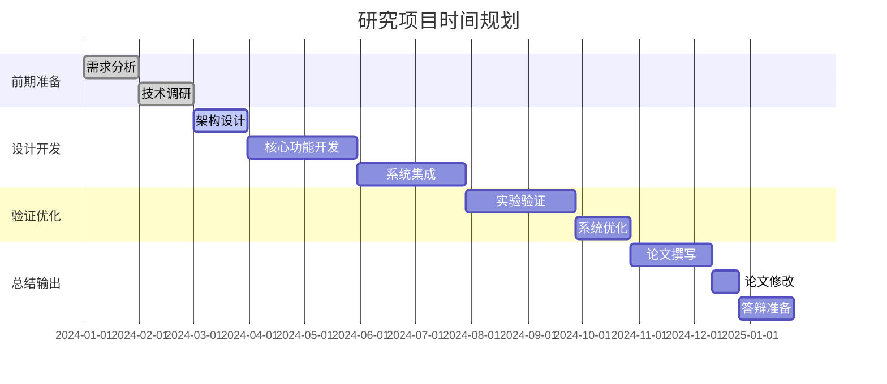

# GenAI模型能效评级体系：研究进度管理方案

## 1. 项目时间总体规划

### 1.1 项目周期
- **总时长**: 12个月
- **起始时间**: 2024年1月
- **结束时间**: 2024年12月
- **关键里程碑**: 8个主要里程碑

### 1.2 阶段划分



## 2. 详细里程碑计划

### 2.1 第一阶段：需求分析与技术调研 (第1-2月)

#### 里程碑M1：需求分析完成 (2024年1月31日)

**目标交付物**
- 需求规格说明书 v1.0
- 用户故事清单
- 功能需求矩阵
- 非功能性需求文档

**具体任务**
- [ ] 文献调研 (10天)
  - [ ] GenAI模型评估相关文献收集
  - [ ] 能效评估方法论研究
  - [ ] 市场价值评估模型调研
- [ ] 需求收集 (10天)
  - [ ] 专家访谈 (5位专家)
  - [ ] 问卷调查 (50份有效问卷)
  - [ ] 竞品分析 (3个主要竞品)
- [ ] 需求分析 (10天)
  - [ ] 功能需求整理
  - [ ] 技术需求分析
  - [ ] 约束条件识别

**成功标准**
- 需求文档通过导师评审
- 关键利益相关者签字确认
- 需求变更率 < 5%

#### 里程碑M2：技术调研完成 (2024年2月29日)

**目标交付物**
- 技术调研报告
- 技术选型方案
- 可行性分析报告
- 技术风险评估报告

**具体任务**
- [ ] 技术方案调研 (5天)
  - [ ] 评估算法研究
  - [ ] 数据处理技术分析
  - [ ] 可视化技术选型
- [ ] 技术验证 (1天)
  - [ ] 原型开发
  - [ ] 性能测试
  - [ ] 可行性验证
- [ ] 技术方案确定 (5天)
  - [ ] 架构设计
  - [ ] 技术栈选择
  - [ ] 开发计划制定

**成功标准**
- 技术方案通过技术评审
- 关键技术风险有应对方案
- 技术选型符合项目约束

### 2.2 第二阶段：架构设计与核心开发 (第3-6月)

#### 里程碑M3：架构设计完成 (2024年3月31日)

**目标交付物**
- 系统架构设计文档
- 数据库设计文档
- API设计规范
- 安全设计方案

**具体任务**
- [ ] 总体架构设计 (10天)
  - [ ] 系统架构图设计
  - [ ] 模块划分和接口定义
  - [ ] 部署架构设计
- [ ] 详细设计 (15天)
  - [ ] 数据库设计
  - [ ] API接口设计
  - [ ] 算法流程设计
- [ ] 设计评审 (5天)
  - [ ] 技术评审会议
  - [ ] 设计优化
  - [ ] 最终方案确定

**成功标准**
- 架构设计通过专家评审
- 满足所有功能和非功能需求
- 设计方案具备可实施性

#### 里程碑M4：核心功能开发完成 (2024年5月31日)

**目标交付物**
- 评估引擎核心模块
- 基础API接口
- 数据处理模块
- 单元测试覆盖率 > 80%

**具体任务**
- [ ] 评估引擎开发 (30天)
  - [ ] 性能评估模块
  - [ ] 效率评估模块
  - [ ] 质量评估模块
  - [ ] 成本评估模块
- [ ] 数据处理开发 (15天)
  - [ ] 数据采集器
  - [ ] 数据清洗模块
  - [ ] 特征工程模块
- [ ] API接口开发 (15天)
  - [ ] 评估接口
  - [ ] 模型管理接口
  - [ ] 结果查询接口

**成功标准**
- 核心功能通过集成测试
- 性能指标满足设计要求
- 代码质量达到标准

#### 里程碑M5：系统集成完成 (2024年6月30日)

**目标交付物**
- 完整Web应用系统
- 前后端集成
- 数据库集成
- 系统测试报告

**具体任务**
- [ ] 前端开发 (30天)
  - [ ] 用户界面开发
  - [ ] 数据可视化组件
  - [ ] 交互功能实现
- [ ] 系统集成 (20天)
  - [ ] 前后端集成
  - [ ] 数据库集成
  - [ ] 第三方服务集成
- [ ] 系统测试 (10天)
  - [ ] 功能测试
  - [ ] 性能测试
  - [ ] 安全测试

**成功标准**
- 系统功能完整可用
- 用户体验良好
- 通过系统验收测试

### 2.3 第三阶段：实验验证与优化 (第7-9月)

#### 里程碑M6：实验验证完成 (2024年8月31日)

**目标交付物**
- 实验设计方案
- 实验数据收集
- 实验结果分析
- 实验验证报告

**具体任务**
- [ ] 实验设计 (15天)
  - [ ] 实验目标确定
  - [ ] 实验方案设计
  - [ ] 评估标准制定
- [ ] 实验执行 (30天)
  - [ ] 数据收集
  - [ ] 模型评估
  - [ ] 结果记录
- [ ] 结果分析 (15天)
  - [ ] 数据统计分析
  - [ ] 结果可视化
  - [ ] 结论总结

**成功标准**
- 实验结果验证系统有效性
- 关键性能指标达标
- 实验数据充分可靠

#### 里程碑M7：系统优化完成 (2024年9月30日)

**目标交付物**
- 性能优化报告
- 用户体验改进方案
- 系统稳定性提升
- 优化后版本发布

**具体任务**
- [ ] 性能优化 (15天)
  - [ ] 算法优化
  - [ ] 数据库优化
  - [ ] 前端性能优化
- [ ] 用户体验优化 (10天)
  - [ ] 界面优化
  - [ ] 交互改进
  - [ ] 响应速度提升
- [ ] 稳定性提升 (5天)
  - [ ] 错误处理完善
  - [ ] 容错机制增强
  - [ ] 监控告警完善

**成功标准**
- 系统性能提升 > 20%
- 用户满意度 > 85%
- 系统稳定性 > 99.9%

### 2.4 第四阶段：论文撰写与答辩 (第10-12月)

#### 里程碑M8：论文初稿完成 (2024年10月15日)

**目标交付物**
- 论文初稿完整版本
- 图表和数据整理
- 参考文献整理
- 格式排版完成

**具体任务**
- [ ] 论文结构设计 (3天)
  - [ ] 章节大纲制定
  - [ ] 内容分配规划
- [ ] 内容撰写 (25天)
  - [ ] 摘要和引言
  - [ ] 相关工作综述
  - [ ] 方法论描述
  - [ ] 实验结果分析
  - [ ] 结论和展望
- [ ] 图表制作 (5天)
  - [ ] 实验结果图表
  - [ ] 系统架构图
  - [ ] 流程图和示意图

**成功标准**
- 论文结构完整
- 内容逻辑清晰
- 格式符合要求

#### 里程碑M9：论文终稿完成 (2024年11月30日)

**目标交付物**
- 论文终稿
- 答辩PPT
- 答辩演讲稿
- 相关支撑材料

**具体任务**
- [ ] 论文修改 (30天)
  - [ ] 导师反馈处理
  - [ ] 同行评议意见处理
  - [ ] 语言和格式润色
- [ ] 答辩准备 (15天)
  - [ ] PPT制作
  - [ ] 演讲稿撰写
  - [ ] 答辩演练

**成功标准**
- 论文通过导师审核
- 答辩材料准备充分
- 答辩演练效果良好

#### 里程碑M10：项目结题 (2024年12月31日)

**目标交付物**
- 项目结题报告
- 代码和文档归档
- 知识产权申请
- 项目总结汇报

**具体任务**
- [ ] 项目总结 (10天)
  - [ ] 成果整理
  - [ ] 经验总结
  - [ ] 教训反思
- [ ] 知识转移 (10天)
  - [ ] 代码文档完善
  - [ ] 使用手册编写
  - [ ] 维护指南制定
- [ ] 后续规划 (10天)
  - [ ] 商业化评估
  - [ ] 后续研究方向
  - [ ] 合作机会探索

**成功标准**
- 项目目标全面达成
- 文档资料完整归档
- 后续发展路径明确

## 3. 进度跟踪机制

### 3.1 日常跟踪

#### 3.1.1 每日站会

**会议内容**
- 昨日完成工作汇报
- 今日计划工作安排
- 遇到的问题和阻碍
- 需要的支持和协调

**跟踪要点**
- 任务完成进度
- 时间消耗统计
- 问题处理状态
- 风险预警识别

#### 3.1.2 工作日志

**记录内容**
- 具体工作内容
- 耗时统计
- 产出物清单
- 问题和解决方案

**提交要求**
- 每个工作日结束前提报
- 格式标准化
- 内容详实准确
- 便于后续查询

### 3.2 周度跟踪

#### 3.2.1 周报制度

**报告内容**
- 本周工作完成情况
- 下周工作计划
- 进度偏差分析
- 风险问题汇报

**报告模板**
```markdown
# 第X周工作周报 (YYYY-MM-DD - YYYY-MM-DD)

## 本周完成工作
- [ ] 任务1: 完成情况描述
- [ ] 任务2: 完成情况描述

## 下周工作计划
- [ ] 计划任务1: 预期目标
- [ ] 计划任务2: 预期目标

## 进度偏差分析
- 计划进度: XX%
- 实际进度: XX%
- 偏差原因: 详细说明

## 风险问题
- 风险1: 影响描述，应对措施
- 问题1: 问题描述，解决方案
```

#### 3.2.2 周例会

**会议议程**
1. 上周工作回顾 (15分钟)
2. 本周计划讨论 (15分钟)
3. 问题风险讨论 (20分钟)
4. 资源协调安排 (10分钟)

**决策机制**
- 问题分级处理
- 责任人明确
- 时间节点确定
- 跟踪机制建立

### 3.3 月度跟踪

#### 3.3.1 月度报告

**报告内容**
- 月度目标完成情况
- 关键指标达成情况
- 重大问题和风险
- 下月重点规划

**分析维度**
- 进度达成率
- 质量指标
- 资源利用率
- 团队协作效率

#### 3.3.2 里程碑评审

**评审内容**
- 里程碑目标达成情况
- 交付物质量评估
- 经验教训总结
- 后续计划调整

**评审流程**
1. 里程碑完成情况汇报
2. 交付物展示和评估
3. 问题讨论和分析
4. 改进措施制定
5. 后续计划确认

## 4. 风险管控机制

### 4.1 风险识别

#### 4.1.1 技术风险

**高风险项**
- 评估算法准确性不足
- 系统性能无法满足要求
- 数据处理效率低下
- 第三方服务依赖风险

**中风险项**
- 技术方案复杂度超预期
- 开发工具和环境问题
- 代码质量不达标
- 安全漏洞风险

#### 4.1.2 项目风险

**高风险项**
- 关键人员流失
- 需求频繁变更
- 进度严重延期
- 预算超支

**中风险项**
- 团队协作效率低
- 沟通不畅
- 资源不足
- 外部依赖延迟

### 4.2 风险应对

#### 4.2.1 预防策略

**技术风险预防**
- 早期技术验证
- 多方案并行开发
- 定期技术评审
- 专家咨询机制

**项目风险预防**
- 团队建设活动
- 需求变更控制
- 进度缓冲设置
- 资源储备计划

#### 4.2.2 应急方案

**技术应急**
- 降级方案准备
- 替代技术方案
- 外部专家支持
- 技术服务商支持

**项目应急**
- 人员替补计划
- 需求优先级调整
- 进度压缩方案
- 资源调配机制

## 5. 质量保证机制

### 5.1 质量目标

#### 5.1.1 代码质量
- 单元测试覆盖率 > 85%
- 代码规范合规率 > 95%
- 代码审查通过率 > 90%
- 缺陷密度 < 0.5个/KLOC

#### 5.1.2 文档质量
- 文档完整性 > 95%
- 文档准确性 > 98%
- 文档及时性 > 90%
- 文档可读性评分 > 4.0/5.0

#### 5.1.3 系统质量
- 功能正确性 > 99%
- 系统稳定性 > 99.9%
- 性能指标达标率 > 100%
- 用户满意度 > 85%

### 5.2 质量控制

#### 5.2.1 过程控制

**开发过程**
- 代码审查制度
- 自动化测试
- 持续集成
- 质量门禁

**验证过程**
- 单元测试
- 集成测试
- 系统测试
- 用户验收测试

#### 5.2.2 结果验证

**内部验证**
- 功能测试验证
- 性能测试验证
- 安全测试验证
- 兼容性测试验证

**外部验证**
- 专家评估
- 用户试用
- 第三方测试
- 学术同行评议

## 6. 资源管理方案

### 6.1 人力资源管理

#### 6.1.1 人员配置

**核心团队**
- 项目经理: 1人 (100%投入)
- 技术负责人: 1人 (100%投入)
- 后端开发: 2人 (100%投入)
- 前端开发: 1人 (100%投入)
- 数据科学家: 1人 (100%投入)
- 测试工程师: 1人 (80%投入)
- 文档工程师: 1人 (60%投入)

**支持角色**
- 导师指导: 每周2小时
- 专家咨询: 按需投入
- 行政支持: 20%投入

#### 6.1.2 能力提升

**培训计划**
- 技术培训: 每月4小时
- 工具培训: 按需安排
- 软技能培训: 每季度8小时
- 学术研讨: 每月2次

**知识分享**
- 内部技术分享: 每两周1次
- 代码走读: 每周1次
- 文档评审: 每周1次
- 经验总结: 每月1次

### 6.2 设备和环境管理

#### 6.2.1 开发环境

**硬件配置**
- 开发工作站: 8台 (i7/32GB/1TB SSD)
- 测试服务器: 2台 (Xeon/64GB/2TB SSD)
- 数据服务器: 1台 (Xeon/128GB/10TB HDD)
- 备份存储: 20TB网络存储

**软件环境**
- 开发工具: IDE、调试器、版本控制
- 测试工具: 自动化测试、性能测试
- 部署工具: Docker、Kubernetes
- 监控工具: 日志、性能监控

#### 6.2.2 实验环境

**计算资源**
- GPU服务器: 2台 (A100/80GB)
- CPU集群: 20核心/40线程
- 内存配置: 256GB
- 存储空间: 50TB

**软件平台**
- 机器学习框架: PyTorch、TensorFlow
- 数据处理: pandas、numpy、scipy
- 可视化: matplotlib、plotly
- 模型管理: MLflow、Weights & Biases

这个研究进度管理方案为GenAI模型能效评级体系项目提供了全面的进度规划和管理框架，确保项目能够按时、高质量地完成所有研究目标。