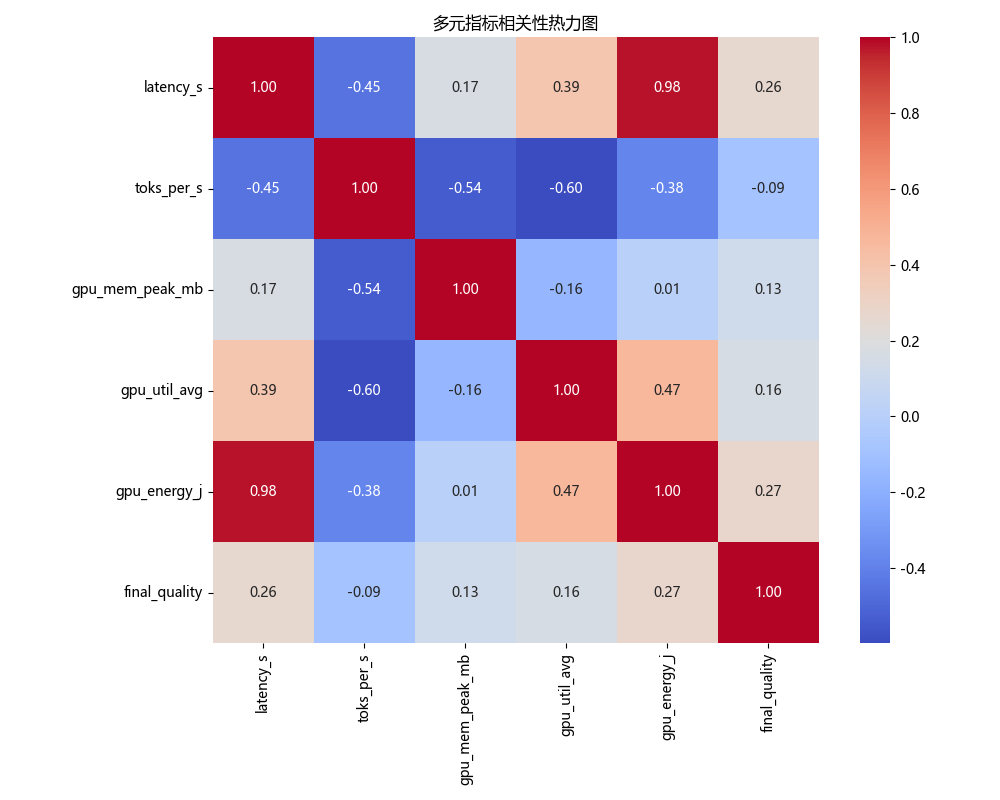
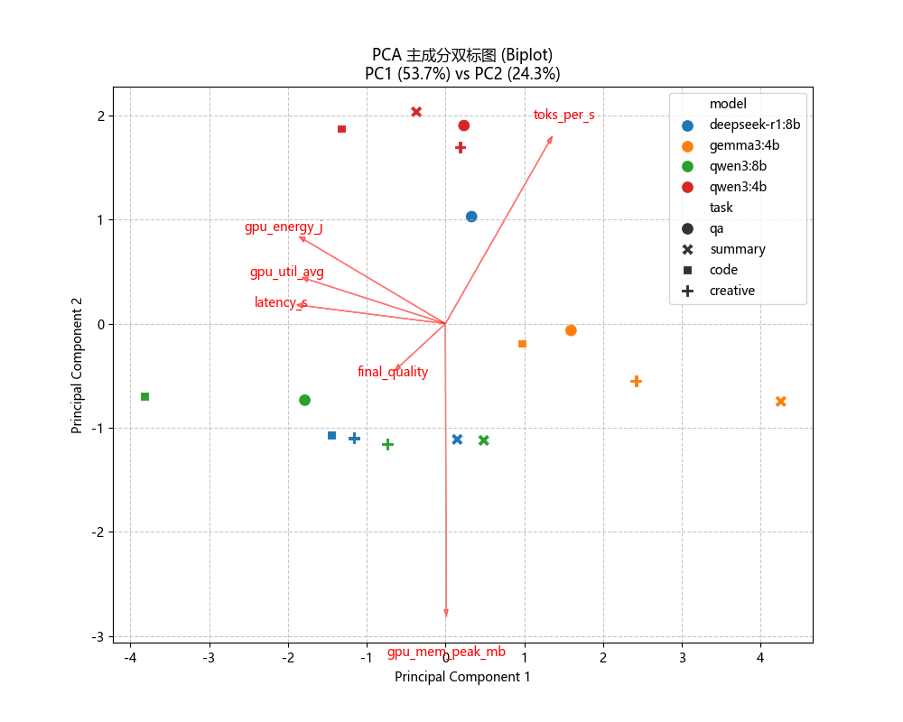
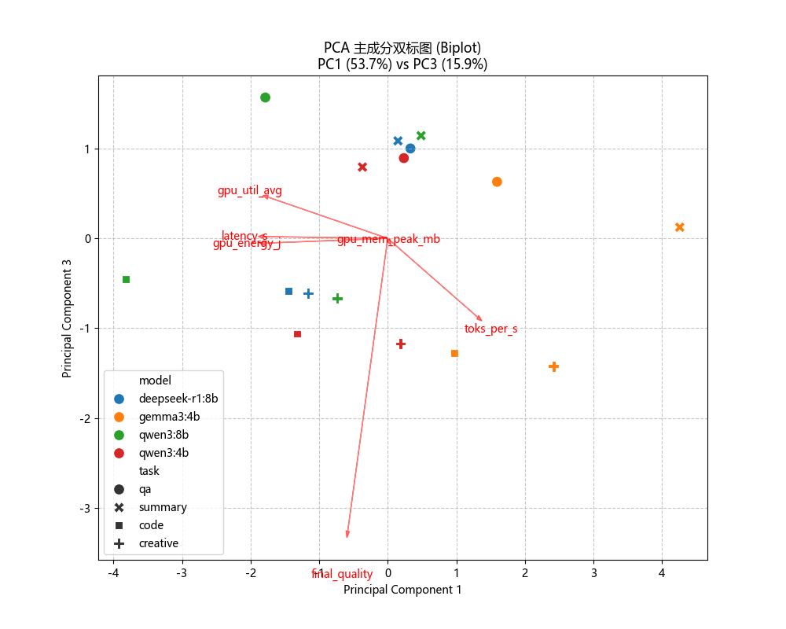
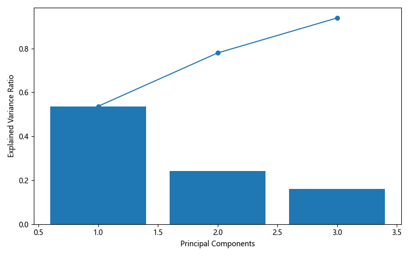
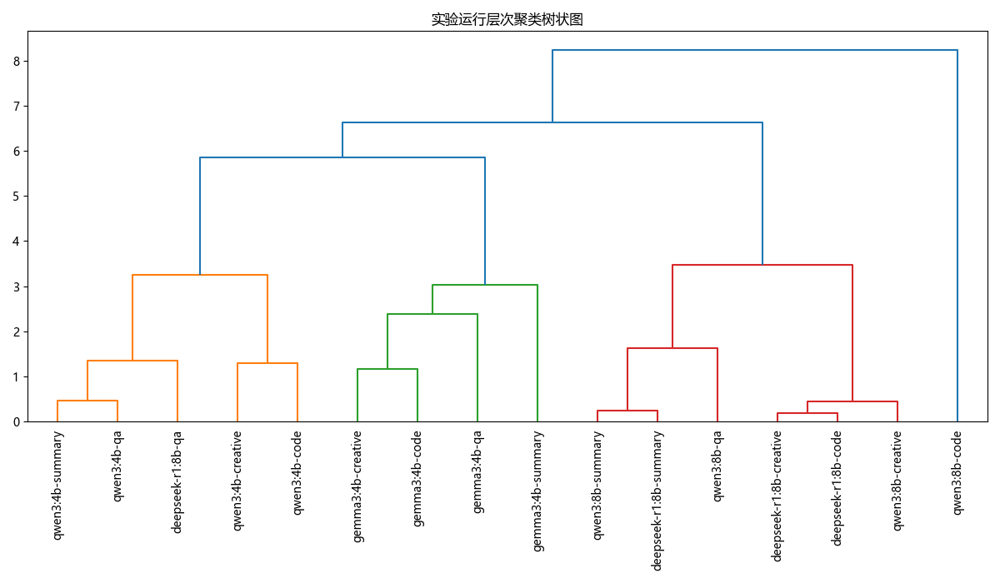
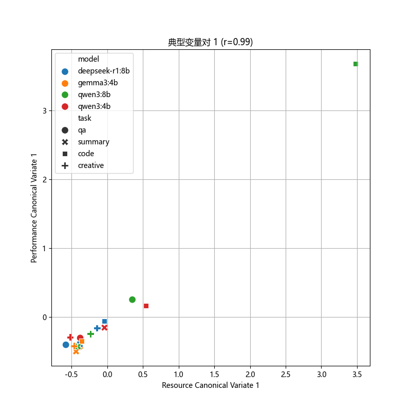

# 实验数据多元统计分析报告

- **生成时间**: 2025-12-11 21:18:32
- **样本数量**: 16
- **数据来源**: `data/experiments_1`

## 1. 多元相关性分析 (Multivariate Correlation)

分析了延迟、吞吐量、显存、利用率、能耗和质量得分之间的线性相关性。

|                 |   latency_s |   toks_per_s |   gpu_mem_peak_mb |   gpu_util_avg |   gpu_energy_j |   final_quality |
|:----------------|------------:|-------------:|------------------:|---------------:|---------------:|----------------:|
| latency_s       |    1        |   -0.450593  |        0.165227   |       0.393352 |     0.976067   |       0.259799  |
| toks_per_s      |   -0.450593 |    1         |       -0.539228   |      -0.597969 |    -0.384468   |      -0.0906445 |
| gpu_mem_peak_mb |    0.165227 |   -0.539228  |        1          |      -0.158929 |     0.00748038 |       0.125232  |
| gpu_util_avg    |    0.393352 |   -0.597969  |       -0.158929   |       1        |     0.467157   |       0.158909  |
| gpu_energy_j    |    0.976067 |   -0.384468  |        0.00748038 |       0.467157 |     1          |       0.273699  |
| final_quality   |    0.259799 |   -0.0906445 |        0.125232   |       0.158909 |     0.273699   |       1         |



## 2. 多元方差分析 (MANOVA)

检验模型公式: `latency_s + toks_per_s + gpu_energy_j + final_quality ~ model + task`

### 检验结果摘要
```text
                    Multivariate linear model
==================================================================
                                                                  
-------------------------------------------------------------------
         Intercept          Value   Num DF  Den DF  F Value  Pr > F
-------------------------------------------------------------------
            Wilks' lambda   0.0457  4.0000  6.0000  31.2901  0.0004
           Pillai's trace   0.9543  4.0000  6.0000  31.2901  0.0004
   Hotelling-Lawley trace  20.8600  4.0000  6.0000  31.2901  0.0004
      Roy's greatest root  20.8600  4.0000  6.0000  31.2901  0.0004
------------------------------------------------------------------
                                                                  
------------------------------------------------------------------
            model           Value   Num DF  Den DF F Value  Pr > F
------------------------------------------------------------------
             Wilks' lambda  0.0029 12.0000 16.1660  10.8566 0.0000
            Pillai's trace  2.1334 12.0000 24.0000   4.9239 0.0004
    Hotelling-Lawley trace 54.5716 12.0000  7.0435  25.4040 0.0001
       Roy's greatest root 51.0250  4.0000  8.0000 102.0501 0.0000
------------------------------------------------------------------
                                                                  
------------------------------------------------------------------
          task            Value    Num DF  Den DF  F Value  Pr > F
------------------------------------------------------------------
          Wilks' lambda    0.0004 12.0000 16.1660   24.5003 0.0000
         Pillai's trace    1.5621 12.0000 24.0000    2.1727 0.0511
 Hotelling-Lawley trace 1162.9280 12.0000  7.0435  541.3630 0.0000
    Roy's greatest root 1161.8630  4.0000  8.0000 2323.7260 0.0000
==================================================================

```

**解读**: 查看 `Pr > F` 列。如果值小于 0.05，说明该因子（模型或任务）对整体性能指标有显著影响。

## 3. 主成分分析 (PCA)

- **PC1 解释方差**: 53.68%
- **PC2 解释方差**: 24.27%
- **PC3 解释方差**: 15.93%
- **累计解释方差**: 93.88%

### 因子载荷 (Factor Loadings)
|                 |         PC1 |        PC2 |         PC3 |
|:----------------|------------:|-----------:|------------:|
| latency_s       | -0.532211   |  0.0510712 |  0.00593785 |
| toks_per_s      |  0.385379   |  0.511461  | -0.257603   |
| gpu_mem_peak_mb |  0.00268316 | -0.806113  | -0.00413959 |
| gpu_util_avg    | -0.513189   |  0.125004  |  0.135073   |
| gpu_energy_j    | -0.524967   |  0.236506  | -0.0154136  |
| final_quality   | -0.171096   | -0.120085  | -0.956612   |







## 4. 层次聚类分析 (Hierarchical Clustering)

使用 Ward 方法和欧氏距离对所有实验运行进行聚类，结果如下：



## 5. 典型相关分析 (Canonical Correlation Analysis)

探索**资源消耗** (显存, 能耗, 利用率) 与 **性能产出** (吞吐, 延迟, 质量) 两组变量之间的关系。

提取了 3 对典型变量，其相关系数分别为：
- **Pair 1**: 0.9902
- **Pair 2**: 0.8638
- **Pair 3**: 0.0181

### 第一对典型变量的载荷 (Loadings for 1st Pair)
| Variable        | Type            |   Loading on CV1 |
|:----------------|:----------------|-----------------:|
| gpu_mem_peak_mb | Resource (X)    |         0.164311 |
| gpu_energy_j    | Resource (X)    |         0.986476 |
| gpu_util_avg    | Resource (X)    |         0.394241 |
| toks_per_s      | Performance (Y) |        -0.440256 |
| latency_s       | Performance (Y) |         0.999472 |
| final_quality   | Performance (Y) |         0.289392 |



