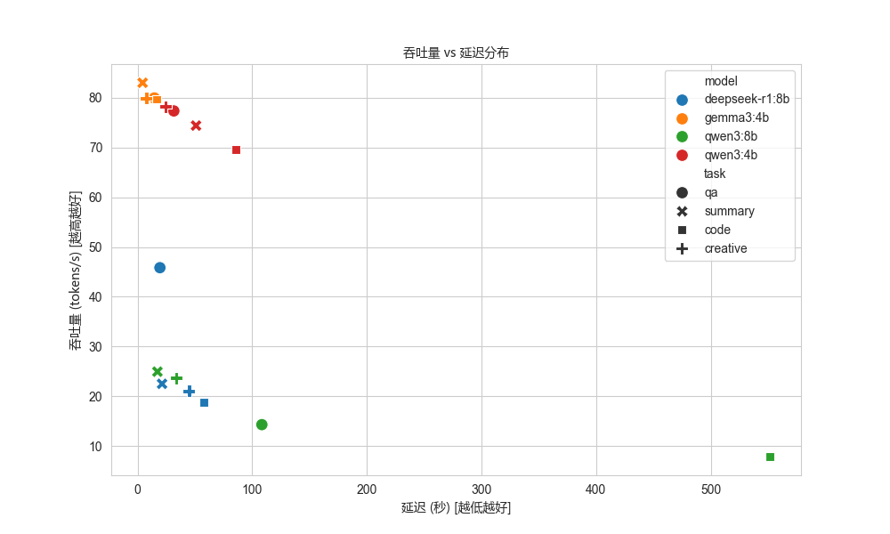
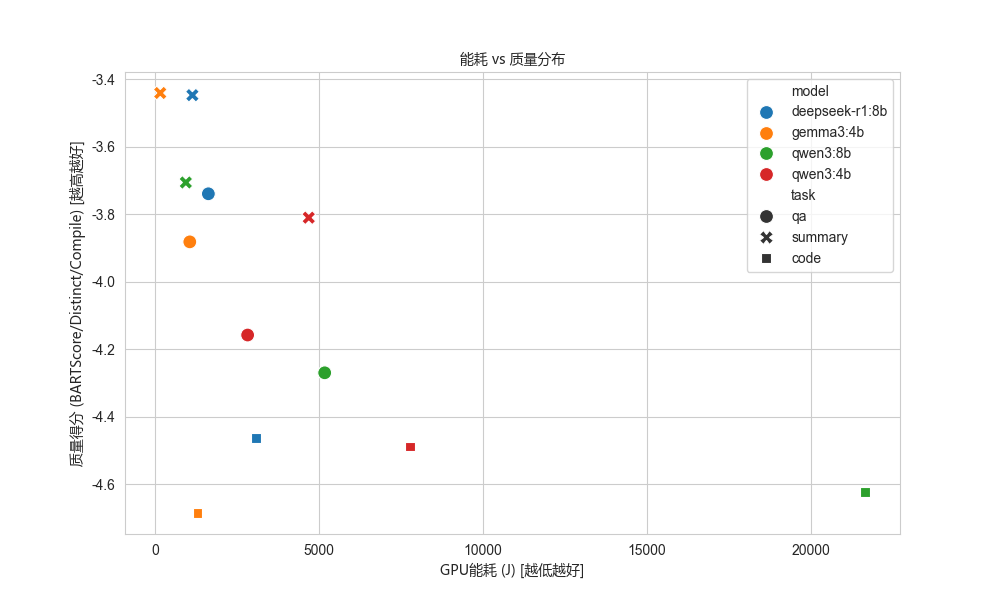
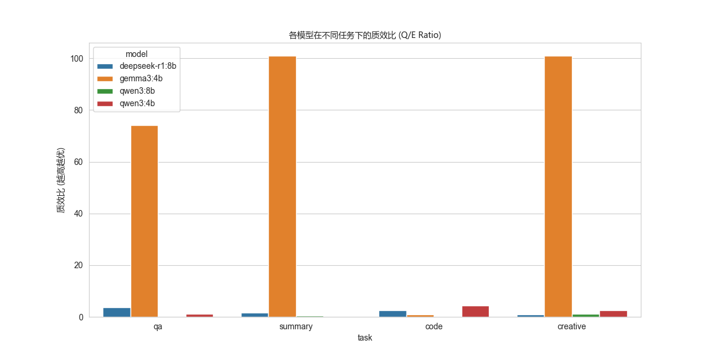
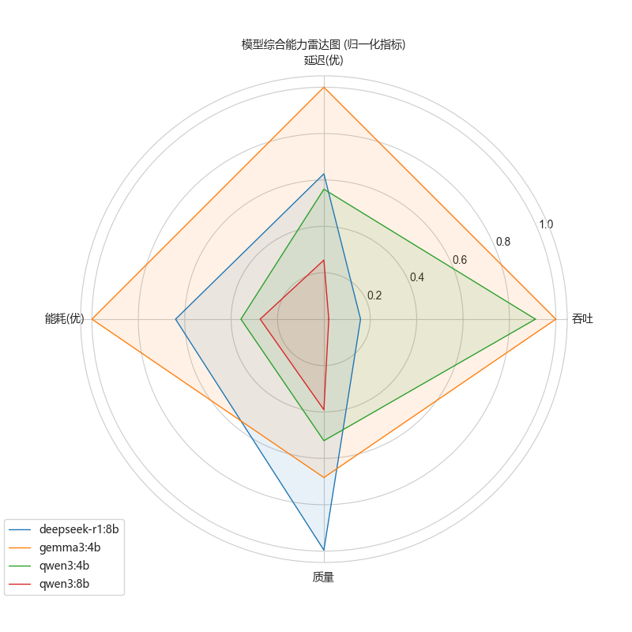

# 实验数据分析报告：基于大语言模型的多维质效比评估

## 1. 实验概况
- **实验批次**: experiments_1
- **生成时间**: 2025-12-10 17:52:49
- **包含模型**: deepseek-r1:8b, gemma3:4b, qwen3:8b, qwen3:4b
- **包含任务**: qa, summary, code, creative
- **总样本数**: 16

## 2. 关键发现
- **综合质效比最优**: **gemma3:4b**，在质量与资源消耗之间取得了最佳平衡。
- **吞吐性能最强**: **gemma3:4b**，适合对延迟敏感的高并发场景。
- **最节能模型**: **gemma3:4b**，适合端侧或低功耗场景。

## 3. 详细指标分析

### 3.1 效率维度
- **吞吐量 (TPS)**: 
  - 均值: 50.07 tokens/s
  - 峰值: 83.02 tokens/s (由 gemma3:4b 贡献)
- **能耗 (Energy)**:
  - 平均单次请求能耗: 3661.71 J

### 3.2 质量维度
- **BARTScore (QA/Summary)**: 
  - 均值: -4.0597
  - 最优: -3.4409

### 3.3 质效比 (Q/E Ratio)
- 该指标综合了归一化的质量得分与效率成本（1 - 效率得分）。
- 排名如下：
| model          |   qe_ratio |
|:---------------|-----------:|
| gemma3:4b      |  69.2856   |
| deepseek-r1:8b |   2.22733  |
| qwen3:4b       |   2.01036  |
| qwen3:8b       |   0.519797 |

## 4. 可视化图表
### 4.1 吞吐量 vs 延迟

### 4.2 能耗 vs 质量

### 4.3 质效比对比

### 4.4 综合雷达图

## 5. 数据摘要表
| model          | task     | load   |   count |   latency_mean |   latency_std |   tps_mean |   tps_std |   gmem_peak_mean |   gutil_mean |   energy_j_mean |   bartscore_mean |
|:---------------|:---------|:-------|--------:|---------------:|--------------:|-----------:|----------:|-----------------:|-------------:|----------------:|-----------------:|
| deepseek-r1:8b | qa       | custom |       1 |       19.4442  |             0 |   45.8375  |         0 |          6424.43 |      86.3444 |        1634.66  |         -3.7397  |
| gemma3:4b      | qa       | custom |       1 |       14.5891  |             0 |   79.9681  |         0 |          7934.39 |      73.1176 |        1068.35  |         -3.88222 |
| qwen3:8b       | qa       | custom |       1 |      108.38    |             0 |   14.2771  |         0 |          8103.63 |      96.332  |        5180.96  |         -4.27036 |
| qwen3:4b       | qa       | custom |       1 |       31.565   |             0 |   77.3599  |         0 |          6297.72 |      87.8163 |        2831.68  |         -4.15838 |
| deepseek-r1:8b | summary  | custom |       1 |       21.3044  |             0 |   22.4873  |         0 |          8094.32 |      85.7347 |        1147.67  |         -3.44738 |
| gemma3:4b      | summary  | custom |       1 |        4.33086 |             0 |   83.0231  |         0 |          7894.91 |      37.1    |         166.931 |         -3.44095 |
| qwen3:8b       | summary  | custom |       1 |       17.2601  |             0 |   24.9281  |         0 |          8085.07 |      83      |         947.119 |         -3.70623 |
| qwen3:4b       | summary  | custom |       1 |       50.9336  |             0 |   74.4153  |         0 |          6250.1  |      89.6568 |        4694.77  |         -3.81053 |
| deepseek-r1:8b | code     | custom |       1 |       57.8755  |             0 |   18.7645  |         0 |          8085.91 |      93.5947 |        3084.32  |         -4.46299 |
| gemma3:4b      | code     | custom |       1 |       16.5566  |             0 |   79.7108  |         0 |          7884.11 |      76.6623 |        1303.52  |         -4.68594 |
| qwen3:8b       | code     | custom |       1 |      551.383   |             0 |    7.85434 |         0 |          8087.82 |      98.4718 |       21646.4   |         -4.62339 |
| qwen3:4b       | code     | custom |       1 |       85.4442  |             0 |   69.536   |         0 |          6231.14 |      90.9798 |        7776.01  |         -4.48859 |
| deepseek-r1:8b | creative | custom |       1 |       44.7926  |             0 |   21.063   |         0 |          8096.08 |      92.7157 |        2522.68  |        nan       |
| gemma3:4b      | creative | custom |       1 |        7.57651 |             0 |   79.9087  |         0 |          7843.08 |      59.3143 |         463.322 |        nan       |
| qwen3:8b       | creative | custom |       1 |       33.7616  |             0 |   23.6647  |         0 |          8100.39 |      88.8052 |        1962.52  |        nan       |
| qwen3:4b       | creative | custom |       1 |       24.2933  |             0 |   78.2564  |         0 |          6196.53 |      86.4159 |        2156.4   |        nan       |

---
*注：本报告由自动化分析脚本生成。*
