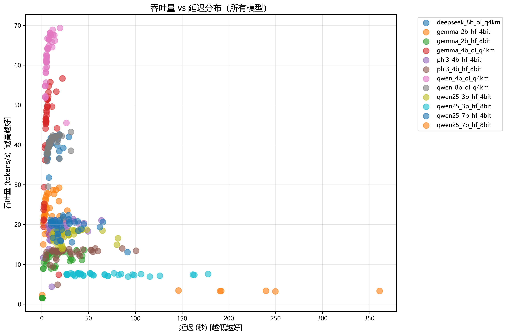
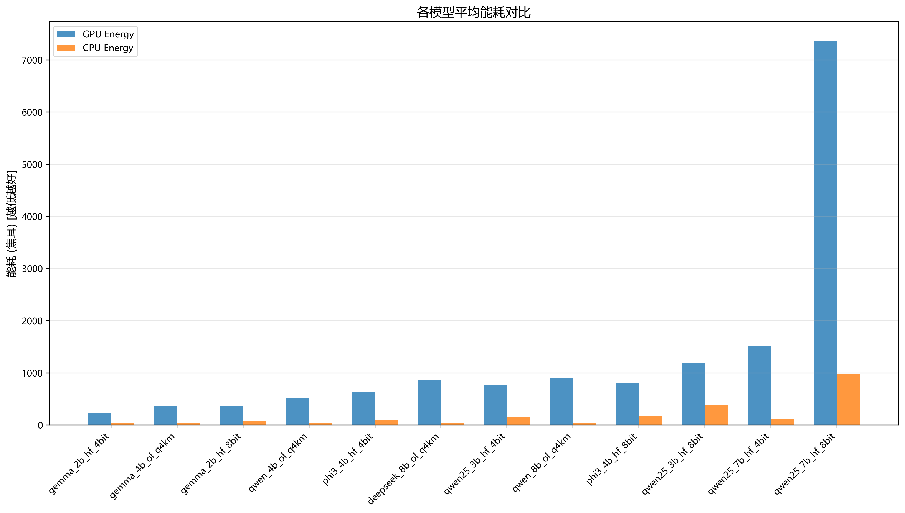
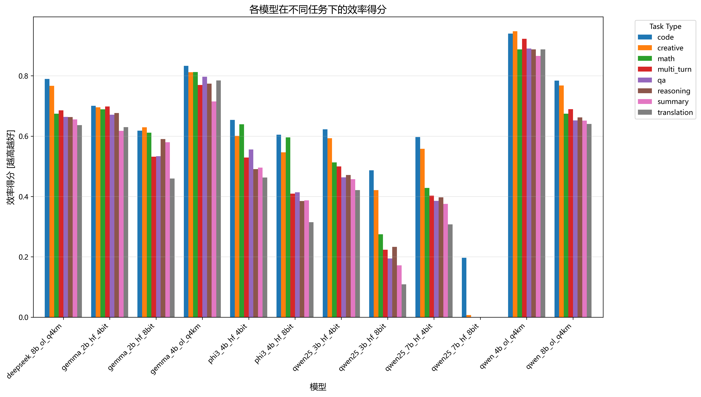
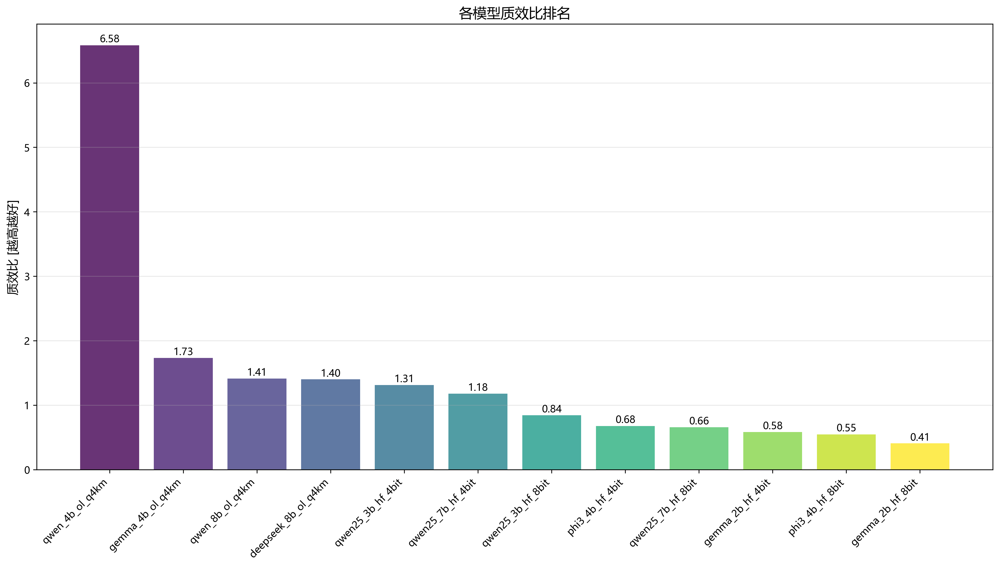
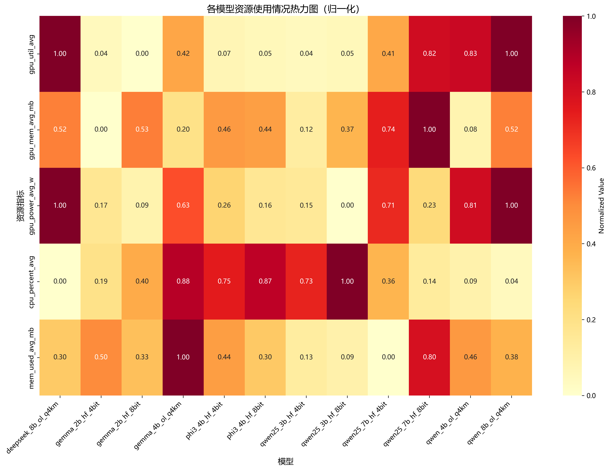
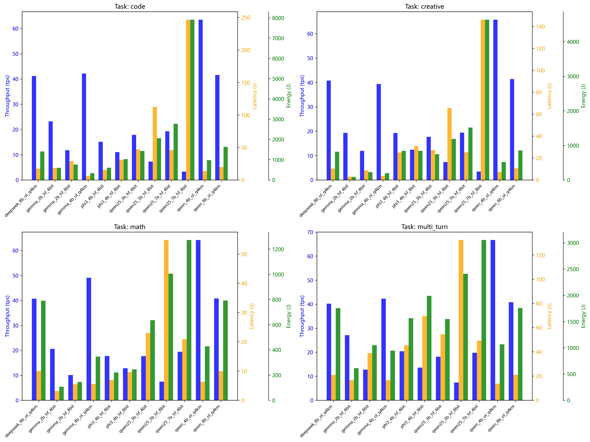

# 多模型综合分析报告

## 1. 实验概况

- **分析时间**: 2026-03-04 10:33:07
- **分析模型数**: 12
- **总实验次数**: 446
- **任务类型**: code, creative, math, multi_turn, qa, reasoning, summary, translation

### 参与评估的模型

- deepseek_8b_ol_q4km
- gemma_2b_hf_4bit
- gemma_2b_hf_8bit
- gemma_4b_ol_q4km
- phi3_4b_hf_4bit
- phi3_4b_hf_8bit
- qwen25_3b_hf_4bit
- qwen25_3b_hf_8bit
- qwen25_7b_hf_4bit
- qwen25_7b_hf_8bit
- qwen_4b_ol_q4km
- qwen_8b_ol_q4km

## 2. 关键发现

### 2.1 综合最优模型

- **最佳质效比**: **qwen_4b_ol_q4km** - 在质量与资源消耗之间取得最佳平衡
- **最高吞吐量**: **qwen_4b_ol_q4km** - 适合高并发、低延迟场景
- **最节能模型**: **gemma_2b_hf_4bit** - 适合边缘设备和低功耗场景
- **最高效率**: **qwen_4b_ol_q4km** - 综合效率指标最优

### 2.2 性能维度分析

#### 吞吐量 (Throughput)
- 平均吞吐量: 26.05 tokens/s
- 最高吞吐量: 69.36 tokens/s (qwen_4b_ol_q4km)
- 最低吞吐量: 1.53 tokens/s (gemma_2b_hf_4bit)

#### 延迟 (Latency)
- 平均延迟: 22.95 秒
- 最低延迟: 0.44 秒 (gemma_2b_hf_4bit)
- 最高延迟: 360.99 秒 (qwen25_7b_hf_8bit)

#### 能耗 (Energy)
- 平均GPU能耗: 831.87 焦耳
- 最低能耗: 4.83 焦耳 (gemma_2b_hf_4bit)
- 最高能耗: 11724.04 焦耳 (qwen25_7b_hf_8bit)

### 2.3 资源使用分析

#### GPU使用率
- 平均GPU利用率: 52.87%
- 平均GPU显存: 4891.46 MB
- 平均GPU功率: 44.44 W

#### CPU和内存
- 平均CPU使用率: 10.94%
- 平均内存使用: 9811.35 MB

## 3. 模型排名

### 3.1 质效比排名 (Q/E Ratio)

|   排名 | 模型                |   平均质效比 |
|-------:|:--------------------|-------------:|
|      1 | qwen_4b_ol_q4km     |     6.58245  |
|      2 | gemma_4b_ol_q4km    |     1.73388  |
|      3 | qwen_8b_ol_q4km     |     1.41431  |
|      4 | deepseek_8b_ol_q4km |     1.40168  |
|      5 | qwen25_3b_hf_4bit   |     1.31421  |
|      6 | qwen25_7b_hf_4bit   |     1.18111  |
|      7 | qwen25_3b_hf_8bit   |     0.843361 |
|      8 | phi3_4b_hf_4bit     |     0.67894  |
|      9 | qwen25_7b_hf_8bit   |     0.658527 |
|     10 | gemma_2b_hf_4bit    |     0.582641 |
|     11 | phi3_4b_hf_8bit     |     0.548166 |
|     12 | gemma_2b_hf_8bit    |     0.407809 |

### 3.2 效率得分排名

|   排名 | 模型                |   平均效率得分 |
|-------:|:--------------------|---------------:|
|      1 | qwen_4b_ol_q4km     |       0.903573 |
|      2 | gemma_4b_ol_q4km    |       0.787175 |
|      3 | deepseek_8b_ol_q4km |       0.691937 |
|      4 | qwen_8b_ol_q4km     |       0.690205 |
|      5 | gemma_2b_hf_4bit    |       0.672316 |
|      6 | gemma_2b_hf_8bit    |       0.569173 |
|      7 | phi3_4b_hf_4bit     |       0.553521 |
|      8 | qwen25_3b_hf_4bit   |       0.505116 |
|      9 | phi3_4b_hf_8bit     |       0.457147 |
|     10 | qwen25_7b_hf_4bit   |       0.431395 |
|     11 | qwen25_3b_hf_8bit   |       0.264171 |
|     12 | qwen25_7b_hf_8bit   |       0.164983 |

### 3.3 能耗排名（越低越好）

|   排名 | 模型                |   平均GPU能耗(J) |
|-------:|:--------------------|-----------------:|
|      1 | gemma_2b_hf_4bit    |          225.269 |
|      2 | gemma_2b_hf_8bit    |          356.15  |
|      3 | gemma_4b_ol_q4km    |          358.852 |
|      4 | qwen_4b_ol_q4km     |          524.322 |
|      5 | phi3_4b_hf_4bit     |          641.019 |
|      6 | qwen25_3b_hf_4bit   |          770.539 |
|      7 | phi3_4b_hf_8bit     |          808.872 |
|      8 | deepseek_8b_ol_q4km |          868.216 |
|      9 | qwen_8b_ol_q4km     |          906.472 |
|     10 | qwen25_3b_hf_8bit   |         1187.36  |
|     11 | qwen25_7b_hf_4bit   |         1523.98  |
|     12 | qwen25_7b_hf_8bit   |         7362.14  |

## 4. 按任务类型分析

### 4.1 CODE 任务

- 实验次数: 60
- 平均吞吐量: 24.75 tokens/s
- 平均延迟: 50.26 秒
- 平均能耗: 1790.55 焦耳
- 最佳模型: qwen_4b_ol_q4km

### 4.2 CREATIVE 任务

- 实验次数: 56
- 平均吞吐量: 26.36 tokens/s
- 平均延迟: 22.01 秒
- 平均能耗: 781.61 焦耳
- 最佳模型: qwen_4b_ol_q4km

### 4.3 MATH 任务

- 实验次数: 55
- 平均吞吐量: 27.31 tokens/s
- 平均延迟: 14.15 秒
- 平均能耗: 544.23 焦耳
- 最佳模型: qwen_4b_ol_q4km

### 4.4 MULTI_TURN 任务

- 实验次数: 55
- 平均吞吐量: 28.09 tokens/s
- 平均延迟: 43.49 秒
- 平均能耗: 1613.22 焦耳
- 最佳模型: qwen_4b_ol_q4km

### 4.5 QA 任务

- 实验次数: 55
- 平均吞吐量: 26.45 tokens/s
- 平均延迟: 10.96 秒
- 平均能耗: 387.44 焦耳
- 最佳模型: qwen_4b_ol_q4km

### 4.6 REASONING 任务

- 实验次数: 55
- 平均吞吐量: 26.98 tokens/s
- 平均延迟: 17.18 秒
- 平均能耗: 640.66 焦耳
- 最佳模型: qwen_4b_ol_q4km

### 4.7 SUMMARY 任务

- 实验次数: 55
- 平均吞吐量: 21.55 tokens/s
- 平均延迟: 9.63 秒
- 平均能耗: 339.04 焦耳
- 最佳模型: qwen_4b_ol_q4km

### 4.8 TRANSLATION 任务

- 实验次数: 55
- 平均吞吐量: 27.05 tokens/s
- 平均延迟: 13.48 秒
- 平均能耗: 472.00 焦耳
- 最佳模型: qwen_4b_ol_q4km

## 5. 可视化图表

### 5.1 吞吐量 vs 延迟

### 5.2 能耗效率对比

### 5.3 效率得分对比

### 5.4 质效比排名

### 5.5 资源使用热力图

### 5.6 任务性能对比

## 6. 详细统计数据

### 6.1 模型汇总统计

| model               |   throughput_tps_mean |   throughput_tps_std |   throughput_tps_max |   latency_s_mean |   latency_s_std |   latency_s_min |   gpu_energy_j_mean |   gpu_energy_j_std |   gpu_energy_j_min |   gpu_power_avg_w_mean |   gpu_power_avg_w_std |   gpu_util_avg_mean |   gpu_util_avg_std |   gpu_mem_avg_mb_mean |   gpu_mem_avg_mb_max |   cpu_percent_avg_mean |   cpu_percent_avg_std |   mem_used_avg_mb_mean |   mem_used_avg_mb_max |   response_length_mean |   response_length_std |   efficiency_score_mean |   efficiency_score_std |   qe_ratio_mean |   qe_ratio_std |
|:--------------------|----------------------:|---------------------:|---------------------:|-----------------:|----------------:|----------------:|--------------------:|-------------------:|-------------------:|-----------------------:|----------------------:|--------------------:|-------------------:|----------------------:|---------------------:|-----------------------:|----------------------:|-----------------------:|----------------------:|-----------------------:|----------------------:|------------------------:|-----------------------:|----------------:|---------------:|
| deepseek_8b_ol_q4km |                 39.71 |                 2.24 |                42.61 |            10.97 |            5.58 |            5.29 |              868.22 |             496.13 |             363.7  |                  76.41 |                  5.96 |               83.97 |               5.02 |               5682.49 |              5692.62 |                   8.79 |                  1.16 |                9620.41 |               9782.15 |                 774.18 |                735.64 |                    0.69 |                   0.06 |            1.4  |           0.84 |
| gemma_2b_hf_4bit    |                 20.14 |                 8.52 |                29.24 |             6.99 |            7.19 |            0.44 |              225.27 |             246.99 |               4.83 |                  27.95 |                  8.32 |               37.3  |              12.63 |               2987.26 |              3030.62 |                   9.67 |                  3.22 |               10218.3  |              11440.7  |                 407.1  |                547.31 |                    0.67 |                   0.05 |            0.58 |           0.56 |
| gemma_2b_hf_8bit    |                 10.37 |                 3.64 |                13.6  |            13.85 |           13.22 |            0.64 |              356.15 |             356.89 |               7.97 |                  23.28 |                  4.96 |               35.19 |               9.29 |               5704.47 |              5768.62 |                  10.6  |                  3.14 |                9710.03 |              11009.1  |                 374.62 |                406.98 |                    0.57 |                   0.07 |            0.41 |           0.33 |
| gemma_4b_ol_q4km    |                 42.01 |                12.5  |                56.68 |             6.19 |            4.51 |            1.95 |              358.85 |             299.65 |              56.52 |                  54.79 |                 13.43 |               55.53 |              13.04 |               3996    |              4032.62 |                  12.76 |                  3.87 |               11667    |              11874.5  |                 553.05 |                361.16 |                    0.79 |                   0.06 |            1.73 |           1.15 |
| phi3_4b_hf_4bit     |                 18.92 |                 3.1  |                21.35 |            18.46 |           13.27 |            1.46 |              641.02 |             490.61 |              23.53 |                  33.55 |                  4.64 |               38.53 |               3.53 |               5337.23 |              8130.37 |                  12.15 |                  1.72 |               10045.6  |              11018.7  |                 478.92 |                392.14 |                    0.55 |                   0.08 |            0.68 |           0.37 |
| phi3_4b_hf_8bit     |                 12.8  |                 1.64 |                14    |            27.97 |           21.54 |            4.14 |              808.87 |             671.49 |              93.68 |                  27.62 |                  3.37 |               37.74 |               3.16 |               5241.79 |              5396.62 |                  12.7  |                  1.4  |                9639.33 |              10313.5  |                 515.25 |                484.59 |                    0.46 |                   0.12 |            0.55 |           0.3  |
| qwen25_3b_hf_4bit   |                 17.17 |                 1.42 |                18.78 |            27.79 |           16.87 |           11.35 |              770.54 |             501.86 |             287.05 |                  26.97 |                  2.58 |               37.2  |               1.9  |               3629.78 |              3652.62 |                  12.06 |                  1.17 |                9119.82 |              10070.9  |                1092.18 |                844.68 |                    0.51 |                   0.08 |            1.31 |           0.43 |
| qwen25_3b_hf_8bit   |                  7.43 |                 0.24 |                 7.76 |            64.98 |           39.64 |           26.44 |             1187.36 |             731.83 |             475.94 |                  18.24 |                  0.36 |               37.81 |               0.67 |               4872.36 |              4892.63 |                  13.28 |                  0.9  |                9025.44 |               9831.15 |                1031.03 |                727.52 |                    0.26 |                   0.14 |            0.84 |           0.27 |
| qwen25_7b_hf_4bit   |                 19.36 |                 2.09 |                22.34 |            25.29 |           16.99 |            9.45 |             1523.98 |            1005.32 |             570.29 |                  59.79 |                  4.01 |               55.07 |               6.08 |               6791.71 |              6826.62 |                  10.43 |                  0.68 |                8750.93 |               9692.64 |                1185.05 |               1066.53 |                    0.43 |                   0.11 |            1.18 |           0.41 |
| qwen25_7b_hf_8bit   |                  3.32 |                 0.07 |                 3.42 |           229.79 |           74.41 |          146.06 |             7362.14 |            2453.42 |            4634.56 |                  31.93 |                  0.19 |               75.04 |               2.54 |               8131.19 |              8170.64 |                   9.4  |                  0.5  |               11072.5  |              11399    |                2505.5  |               1102    |                    0.16 |                   0.13 |            0.66 |           0.1  |
| qwen_4b_ol_q4km     |                 62.12 |                 5.58 |                69.36 |             7.56 |            4.61 |            3.65 |              524.32 |             355.54 |             187.15 |                  65.6  |                  8.04 |               75.87 |               6.46 |               3391.2  |              3400.62 |                   9.21 |                  0.87 |               10086.6  |              10156.3  |                1010.48 |                892    |                    0.9  |                   0.04 |            6.58 |           3.86 |
| qwen_8b_ol_q4km     |                 39.98 |                 2.48 |                43.24 |            11.4  |            6.36 |            5.26 |              906.47 |             559.86 |             354.39 |                  76.48 |                  5.92 |               84.04 |               5.67 |               5685.8  |              5692.62 |                   8.97 |                  0.79 |                9852.2  |               9992.62 |                 896.5  |                807.63 |                    0.69 |                   0.06 |            1.41 |           0.77 |

## 7. 结论与建议

### 7.1 模型选择建议

1. **高性能场景**: 选择 **qwen_4b_ol_q4km**，具有最高吞吐量
2. **低功耗场景**: 选择 **gemma_2b_hf_4bit**，能耗最低
3. **综合平衡**: 选择 **qwen_4b_ol_q4km**，质效比最优

### 7.2 优化方向

- 对于高能耗模型，考虑量化优化（4bit/8bit）
- 对于低吞吐模型，考虑批处理优化
- 根据具体任务类型选择合适的模型

### 7.3 数据说明

- 本报告基于实际运行数据生成
- 归一化指标按任务类型分组计算
- 质效比 = (归一化质量 + 0.01) / (1.01 - 效率得分)
- 效率得分 = 0.4×吞吐 + 0.3×延迟优 + 0.3×能耗优

---

*报告生成时间: 2026-03-04 10:33:07*
*分析脚本: analyze_all_models.py*
