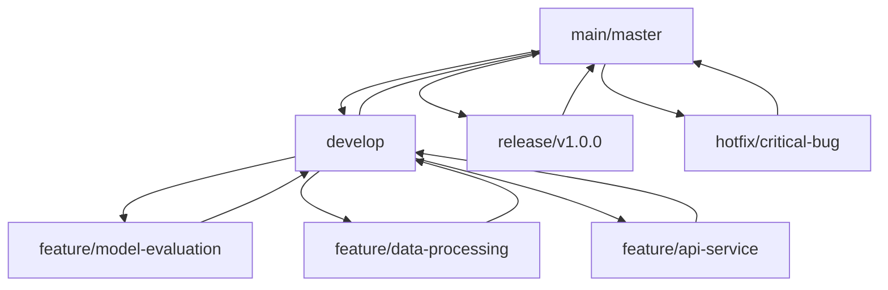
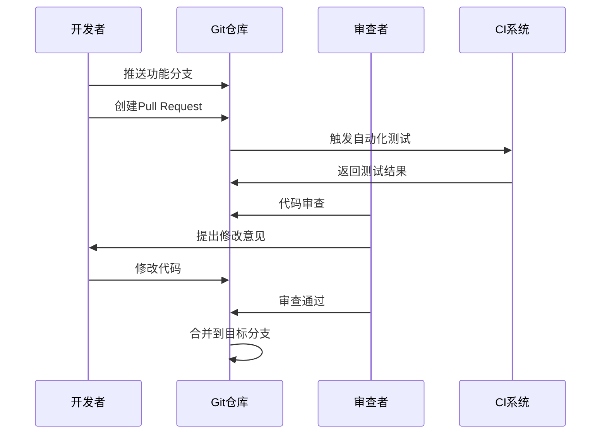

# GenAI模型能效评级体系：版本控制策略

## 1. 版本控制总体策略

### 1.1 版本控制目标
- **代码版本管理**: 确保代码变更可追溯、可回滚
- **协作效率提升**: 支持多人并行开发，减少冲突
- **质量保证**: 通过代码审查确保代码质量
- **发布管理**: 支持多版本并行维护和发布

### 1.2 版本控制原则
- **主分支稳定**: master/main分支始终保持稳定可发布状态
- **功能隔离**: 每个功能开发在独立分支进行
- **频繁集成**: 鼓励频繁提交和集成，减少集成冲突
- **清晰历史**: 提交历史清晰可读，便于追踪和理解

## 2. Git工作流程

### 2.1 分支模型



#### 2.1.1 主分支 (Main Branches)

**master/main 分支**
- 存放正式发布的版本
- 禁止直接提交，只能通过合并
- 每个提交都应该有版本标签
- 保持稳定，随时可部署

**develop 分支**
- 集成所有开发完成的功能
- 日常开发的基础分支
- 功能分支的合并目标
- 相对稳定，可用于内部测试

#### 2.1.2 支持分支 (Supporting Branches)

**功能分支 (Feature Branches)**
- 命名格式: `feature/功能名称`
- 从develop分支创建
- 开发完成后合并回develop分支
- 生命周期：功能开发期间

**发布分支 (Release Branches)**
- 命名格式: `release/版本号`
- 从develop分支创建
- 用于准备发布版本
- 允许小bug修复和版本准备
- 完成后合并到master和develop

**热修复分支 (Hotfix Branches)**
- 命名格式: `hotfix/修复描述`
- 从master分支创建
- 用于紧急修复生产环境bug
- 完成后合并到master和develop

### 2.2 分支命名规范

#### 2.2.1 功能分支命名
```
feature/模块-功能描述
示例:
- feature/model-evaluation-engine
- feature/data-collection-api
- feature/result-visualization
- feature/user-authentication
```

#### 2.2.2 修复分支命名
```
bugfix/问题描述
示例:
- bugfix/memory-leak-in-evaluation
- bugfix/api-response-format
- bugfix/database-connection-timeout
```

#### 2.2.3 发布分支命名
```
release/版本号
示例:
- release/v1.0.0
- release/v1.1.0
- release/v2.0.0-beta
```

#### 2.2.4 热修复分支命名
```
hotfix/紧急问题描述
示例:
- hotfix/critical-security-vulnerability
- hotfix/production-database-error
```

## 3. 提交规范

### 3.1 提交信息格式

采用Conventional Commits规范：

```
<类型>(<作用域>): <简短描述>

<详细描述>

<脚注>
```

### 3.2 提交类型

| 类型 | 描述 | 示例 |
|------|------|------|
| feat | 新功能 | feat(model): 添加模型性能评估功能 |
| fix | Bug修复 | fix(api): 修复API响应超时问题 |
| docs | 文档更新 | docs(readme): 更新安装说明 |
| style | 代码格式 | style(css): 优化页面样式 |
| refactor | 代码重构 | refactor(engine): 重构评估引擎 |
| test | 测试相关 | test(unit): 添加单元测试 |
| chore | 构建过程 | chore(deps): 更新依赖包 |
| perf | 性能优化 | perf(algorithm): 优化算法性能 |
| ci | CI/CD相关 | ci(docker): 更新Docker配置 |

### 3.3 提交示例

```bash
# 好的提交示例
git commit -m "feat(evaluation): 添加模型效率评估算法

实现了基于多维指标的模型效率评估算法，包括：
- 计算复杂度分析
- 内存使用评估
- 推理速度测试

Closes #123"

# 不好的提交示例
git commit -m "update code"
```

### 3.4 提交频率建议

- **功能开发**: 每完成一个逻辑单元提交一次
- **Bug修复**: 修复完成后立即提交
- **文档更新**: 完成一个完整章节后提交
- **重构**: 每完成一个重构步骤提交

## 4. 代码审查流程

### 4.1 审查要求

#### 4.1.1 审查者要求
- 至少1名项目核心成员审查
- 涉及关键模块需要2名审查者
- 审查者不能是代码作者
- 审查者需要具备相关技术能力

#### 4.1.2 审查内容
- **代码质量**: 可读性、可维护性、性能
- **功能正确性**: 是否满足需求
- **安全性**: 是否存在安全漏洞
- **测试覆盖**: 是否包含相应测试

### 4.2 审查流程



### 4.3 Pull Request模板

```markdown
## 变更描述
简要描述本次变更的内容和目的

## 变更类型
- [ ] 新功能 (feat)
- [ ] Bug修复 (fix)
- [ ] 文档更新 (docs)
- [ ] 代码重构 (refactor)
- [ ] 性能优化 (perf)
- [ ] 其他

## 测试情况
- [ ] 单元测试通过
- [ ] 集成测试通过
- [ ] 手动测试通过
- [ ] 不需要测试

## 代码质量检查
- [ ] 代码符合项目规范
- [ ] 添加了必要的注释
- [ ] 更新了相关文档
- [ ] 没有引入新的警告

## 关联Issue
Fixes #(issue编号)
Relates to #(issue编号)

## 其他说明
其他需要说明的内容
```

## 5. 版本发布管理

### 5.1 语义化版本号

采用Semantic Versioning 2.0.0规范：

```
版本格式: MAJOR.MINOR.PATCH

MAJOR: 不兼容的API变更
MINOR: 向下兼容的功能性新增
PATCH: 向下兼容的问题修正
```

### 5.2 发布流程

#### 5.2.1 发布准备
1. 从develop分支创建release分支
2. 在release分支上进行版本准备
3. 更新版本号和CHANGELOG
4. 进行发布前测试

#### 5.2.2 发布执行
1. 将release分支合并到master
2. 在master分支上打版本标签
3. 将release分支合并回develop
4. 删除release分支

#### 5.2.3 发布检查清单

```markdown
# 版本发布检查清单

## 代码质量
- [ ] 所有功能测试通过
- [ ] 性能测试达标
- [ ] 安全扫描通过
- [ ] 代码覆盖率达标

## 文档完整性
- [ ] README文档更新
- [ ] API文档更新
- [ ] 部署文档更新
- [ ] 用户手册更新

## 版本信息
- [ ] 版本号正确更新
- [ ] CHANGELOG更新完成
- [ ] 发布说明编写完成
- [ ] 已知问题清单整理

## 部署准备
- [ ] 部署脚本测试通过
- [ ] 环境配置确认
- [ ] 回滚方案准备
- [ ] 监控告警配置
```

### 5.3 版本标签管理

#### 5.3.1 标签命名规范
```bash
# 正式版本
v1.0.0
v1.1.0
v2.0.0

# 预发布版本
v1.0.0-alpha.1
v1.0.0-beta.1
v1.0.0-rc.1

# 热修复版本
v1.0.1
v1.0.2
```

#### 5.3.2 标签创建命令
```bash
# 创建带注释的标签
git tag -a v1.0.0 -m "Release version 1.0.0"

# 推送标签到远程
git push origin v1.0.0

# 推送所有标签
git push origin --tags
```

## 6. 协作开发规范

### 6.1 分支管理策略

#### 6.1.1 个人开发流程
```bash
# 1. 更新本地develop分支
git checkout develop
git pull origin develop

# 2. 创建功能分支
git checkout -b feature/new-feature

# 3. 开发并提交
git add .
git commit -m "feat(module): add new feature"

# 4. 推送到远程
git push origin feature/new-feature

# 5. 创建Pull Request
# 在GitHub/GitLab上创建PR，等待审查
```

#### 6.1.2 团队协作要点

**分支同步**
- 每日开始工作前同步develop分支
- 功能开发完成后及时合并
- 避免长期存在的功能分支

**冲突处理**
- 及时发现和解决冲突
- 优先采用rebase而非merge
- 冲突解决后进行充分测试

**沟通协调**
- 重要变更提前沟通
- 复杂功能分工协作
- 定期同步开发进度

### 6.2 代码所有权

#### 6.2.1 模块责任人

| 模块 | 主要负责人 | 备用负责人 |
|------|------------|------------|
| 评估引擎 | 张三 | 李四 |
| API服务 | 李四 | 王五 |
| 数据处理 | 王五 | 张三 |
| 前端界面 | 赵六 | 张三 |
| 文档系统 | 孙七 | 李四 |

#### 6.2.2 代码审查分配
- 功能模块代码由主要负责人审查
- 跨模块代码需要多人审查
- 关键代码需要技术负责人审查
- 文档变更由文档负责人审查

## 7. 备份和恢复策略

### 7.1 仓库备份

#### 7.1.1 自动备份
- **备份频率**: 每日自动备份
- **备份内容**: 所有分支和标签
- **备份位置**: 异地备份服务器
- **保留期限**: 30天滚动保留

#### 7.1.2 手动备份
- **发布前备份**: 每次发布前创建完整备份
- **重大变更前**: 重要架构调整前备份
- **定期归档**: 每月创建归档备份

### 7.2 恢复流程

#### 7.2.1 分支恢复
```bash
# 从备份恢复分支
git checkout -b backup-branch backup/commit-hash

# 恢复误删除的分支
git reflog  # 查看历史记录
git checkout -b restored-branch HEAD@{n}
```

#### 7.2.2 版本回退
```bash
# 回退到指定版本
git revert <commit-hash>

# 强制回退（谨慎使用）
git reset --hard <commit-hash>
git push origin HEAD --force
```

## 8. 安全和权限管理

### 8.1 访问权限控制

#### 8.1.1 分支保护规则
- **主分支保护**: master/main分支禁止直接推送
- **强制审查**: 所有合并需要代码审查
- **状态检查**: 必须通过CI/CD检查
- **签名要求**: 重要提交需要GPG签名

#### 8.1.2 权限分级

| 角色 | 权限范围 | 说明 |
|------|----------|------|
| 项目管理员 | 全部权限 | 仓库管理、权限分配 |
| 核心开发者 | 读写权限 | 代码开发、分支管理 |
| 普通开发者 | 读权限 + 创建PR | 功能开发、提交审查 |
| 观察者 | 只读权限 | 代码查看、学习参考 |

### 8.2 安全最佳实践

#### 8.2.1 敏感信息处理
```bash
# 从提交历史中删除敏感信息
git filter-branch --force --index-filter \
'git rm --cached --ignore-unmatch path/to/sensitive/file' \
--prune-empty --tag-name-filter cat -- --all

# 使用.gitignore忽略敏感文件
echo "config/secrets.json" >> .gitignore
echo ".env" >> .gitignore
```

#### 8.2.2 提交签名
```bash
# 配置GPG签名
git config --global user.signingkey <GPG-key-id>
git config --global commit.gpgsign true

# 创建带签名的提交
git commit -S -m "feat(security): add secure authentication"
```

这个版本控制策略为GenAI模型能效评级体系项目提供了完整的代码版本管理框架，确保团队协作高效、代码质量可控、发布管理规范。